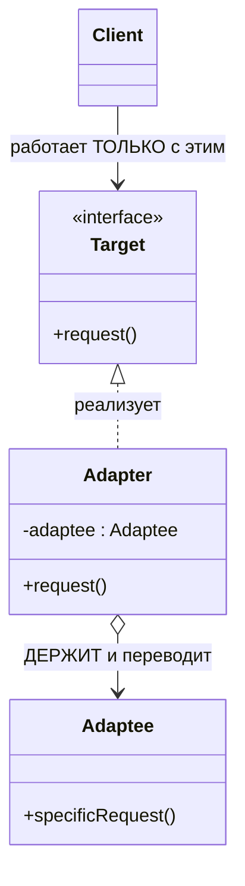
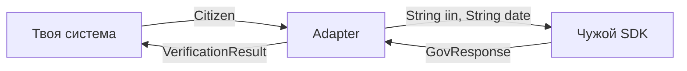

# Золотой урок: паттерн Adapter

> Глубокий разбор одного паттерна — от боли, которая его родила, до тонкостей на собесе. Читай не спеша, код пробуй в IDE. В конце — задачи и самопроверка.

---

## 0. Одна фраза, которую забери сразу

> **Adapter — это переводчик между двумя интерфейсами, которые не стыкуются, и которые ты не можешь изменить.**

Ключевые слова здесь — **«не можешь изменить»**. Если можешь поменять любую из двух сторон, адаптер не нужен: просто приведи их к общему виду. Адаптер появляется именно там, где обе стороны **вне твоей власти**.

---

## 1. Проблема, которая рождает Adapter

Твоя система работает со своим чистым интерфейсом:

```java
interface PaymentProcessor {
    void process(double amount);
}
```

И тут бизнес говорит: «интегрируемся со старым банковским API». Открываешь их SDK:

```java
class LegacyBankApi {                                    // чужая библиотека, менять НЕЛЬЗЯ
    void executeTransaction(long amountInCents, String currencyCode) { ... }
}
```

**Формы не совпадают:**
- у тебя `process(double)`, у них `executeTransaction(long, String)`;
- у тебя доллары, у них центы;
- у тебя нет валюты, у них она обязательна.

Что нельзя сделать:
- **Менять свой интерфейс** — на `PaymentProcessor` завязана вся система, десятки классов. Прогнёшься под чужой SDK — заразишь чужой формой весь свой код.
- **Менять чужой SDK** — он в jar-нике, ты его не контролируешь. Обновится версия — твои правки исчезнут.

Остаётся один выход: **третий класс посередине**, который принимает твой формат и переводит в чужой.

---

## 2. Аналогия, из которой родилось название

Ты летишь из Алматы в Берлин. У ноутбука **казахстанская вилка**, в стене — **европейская розетка**.

- Вилку ноутбука не переделываешь (это **твоё**, ломать нельзя).
- Розетку в отеле не переделываешь (это **чужое**, доступа нет).
- Покупаешь **переходник**: с одной стороны принимает твою вилку, с другой — влезает в их розетку. Внутри просто перекидывает контакты.

Переходник **ничего не добавляет** — он не усиливает ток, не фильтрует напряжение. Он только **стыкует формы**. Ровно это и делает Adapter в коде: не добавляет функциональность, а обеспечивает **совместимость**.

---

## 3. Решение

```java
class LegacyBankAdapter implements PaymentProcessor {   // 1. реализует ТВОЙ интерфейс
    private final LegacyBankApi api;                     // 2. держит ЧУЖОЙ SDK внутри (композиция)

    public LegacyBankAdapter(LegacyBankApi api) {        // 3. зависимость приходит снаружи
        this.api = api;
    }

    @Override
    public void process(double amount) {
        // 4. ПЕРЕВОД: твой формат → чужой формат
        long cents = (long) (amount * 100);              // доллары → центы
        api.executeTransaction(cents, "USD");            // зовём чужой метод в ЕГО форме
    }
}
```

Теперь вся твоя система работает с `PaymentProcessor` и **не подозревает**, что за ним чужой legacy-SDK.

> ⚠️ **Ловушка приоритета операций:** `(long) amount * 100` — сначала **отрезает копейки**, потом умножает: `19.99 → 19 → 1900`. Ты потерял 99 центов на каждой транзакции. Правильно: `(long) (amount * 100)`. В банке такая опечатка стоит дорого.
>
> (А для реальных денег и `double` нельзя вообще — только `BigDecimal`.)

---

## 4. Анатомия: четыре роли



- **Target** — **твой** интерфейс, то, чего ждёт система. `PaymentProcessor`.
- **Adaptee** — **чужой** класс с несовместимым интерфейсом. `LegacyBankApi`.
- **Adapter** — прокладка: реализует Target, держит Adaptee, переводит вызовы. `LegacyBankAdapter`.
- **Client** — твой код, который работает **только с Target** и про Adaptee вообще не знает.

> Проверка на понимание: если Client где-то видит Adaptee — адаптер не сделал свою работу.

---

## 5. ⭐ Перевод идёт в ОБЕ стороны

Самая частая ошибка новичка: перевести **запрос** и забыть про **ответ**. Реальная интеграция всегда двусторонняя.

```java
interface CitizenVerifier {                          // ТВОЙ интерфейс
    VerificationResult verify(Citizen citizen);
}

class GovTechClient {                                // ЧУЖОЙ SDK
    GovResponse checkPerson(String iin, String birthDateFormatted) { ... }
}

class GovResponse {                                  // ЧУЖОЙ ответ — кривой
    int statusCode;        // 0 = ок, всё остальное = ошибка (магическое число!)
    String errorMessage;
}
```

```java
class GovTechVerifierAdapter implements CitizenVerifier {
    private static final DateTimeFormatter FMT = DateTimeFormatter.ofPattern("dd.MM.yyyy");
    private final GovTechClient client;

    public GovTechVerifierAdapter(GovTechClient client) { this.client = client; }

    @Override
    public VerificationResult verify(Citizen citizen) {
        // ── СТОРОНА 1: перевод ВХОДА (твой домен → чужой формат) ──
        GovResponse response = client.checkPerson(
            citizen.getIin(),
            citizen.getBirthDate().format(FMT)       // LocalDate → "01.02.1999"
        );

        // ── СТОРОНА 2: перевод ВЫХОДА (чужой ответ → твой домен) ──
        return new VerificationResult(
            response.statusCode == 0,                 // int-магия → чистый boolean
            response.errorMessage
        );
    }
}
```



> **Правило:** запрос → чужой формат, чужой ответ → твой домен. Проверь **обе** стрелки.

---

## 6. ⭐ Anti-corruption layer (термин из DDD)

Это самая ценная мысль урока и сильный ход на собесе.

Адаптер — не просто «переводчик формата». Это **карантин**, граница, которую чужие типы **не пересекают**.

Что остаётся снаружи и **никогда не попадает** в твой домен:
- чужие DTO (`GovResponse`, `ExternalEmployeeDto`);
- магические числа (`statusCode == 0`);
- странные форматы (`"Y"/"N"` вместо boolean, даты строками);
- их исключения и коды ошибок.

Что даёт этот карантин:

1. **DIP** — система зависит от **твоей** абстракции, а не от чужой библиотеки.
2. **OCP** — смена провайдера = новый адаптер; бизнес-код не трогается **ни строчкой**.
3. **Домен не заражён.** Чужой `int statusCode` — плохой дизайн, но он **чужой**, ты его не выбирал. Внутрь заходит чистый `boolean valid`. Твой домен говорит на **своём** языке.
4. **Тестируемость** — мокаешь свой интерфейс в две строки, а не чужой SDK с его инфраструктурой.
5. **Одна точка изменения** — обновился их API? Правишь **один** класс.

> ⚠️ **Дырка в карантине.** Даже если ты не выпустил `GovResponse` наружу, но контроллер зависит от `GovTechVerifierAdapter` (конкретного класса) вместо `CitizenVerifier` (интерфейса) — ты выпустил **знание о провайдере**. Смысл потерян. Клиент должен видеть **только Target**.

---

## 7. Две формы: object adapter vs class adapter

**Object adapter (композиция)** — то, что выше и что используют в Java всегда:

```java
class LegacyBankAdapter implements PaymentProcessor {
    private final LegacyBankApi api;                   // ДЕРЖИТ adaptee
}
```

**Class adapter (наследование)** — адаптер наследует Adaptee:

```java
class LegacyBankAdapter extends LegacyBankApi implements PaymentProcessor {
    public void process(double amount) {
        executeTransaction((long)(amount * 100), "USD");   // унаследованный метод
    }
}
```

| | Object adapter (композиция) ✅ | Class adapter (наследование) |
|---|---|---|
| Механизм | держит Adaptee полем | наследует Adaptee |
| Можно адаптировать подклассы | да (передал любой) | нет (тип зафиксирован) |
| Java-ограничение | нет | съедает единственный `extends` |
| Инкапсуляция | Adaptee спрятан | наружу торчат **все** методы Adaptee |
| Вердикт | **используй это** | почти никогда |

> Почему в Java побеждает композиция: единственное наследование + `class adapter` протаскивает наружу весь чужой API (нарушая карантин!). Ещё один живой довод «composition over inheritance».

---

## 8. Adapter в дикой природе

**В JDK:**
- `Arrays.asList(array)` — адаптирует **массив** к интерфейсу `List`.
- `InputStreamReader` — адаптирует **байтовый** поток к **символьному** (`InputStream` → `Reader`).
- `Collections.enumeration(collection)` — новый `Iterator`-мир к старому `Enumeration`.

**В Spring:**
- `HandlerAdapter` — приводит разные типы контроллеров к единому виду для DispatcherServlet.
- `WebMvcConfigurer`-адаптеры, `MessageConverter`'ы (объект ↔ JSON/XML).
- Любая твоя обёртка над внешним REST API, приводящая их DTO к твоему домену.

**В твоей работе:**
- обёртка над GovTech API;
- слой между SAP и твоими сущностями;
- унификация нескольких SMS/платёжных провайдеров под один интерфейс.

---

## 9. Adapter в Spring: переключение провайдера через конфиг

Реальный прод-сценарий: два SMS-провайдера с разными SDK, переключаемые **без правки кода**.

```java
public interface SmsSender {                 // ТВОЯ абстракция
    SmsResult send(String phone, String text);
}

@Component
@ConditionalOnProperty(name = "sms.provider", havingValue = "twilio")
class TwilioSmsAdapter implements SmsSender {
    private final TwilioClient client;
    private final String fromNumber;

    public TwilioSmsAdapter(TwilioClient client,
                            @Value("${sms.twilio.from}") String fromNumber) {
        this.client = client;
        this.fromNumber = fromNumber;
    }

    @Override
    public SmsResult send(String phone, String text) {
        // ВНИМАНИЕ на порядок параметров чужого API: (to, from, body)
        TwilioResponse response = client.sendMessage(phone, fromNumber, text);
        return new SmsResult(response.isDelivered(), response.getErrorText());
    }
}

@Component
@ConditionalOnProperty(name = "sms.provider", havingValue = "kz")
class KzSmsAdapter implements SmsSender {
    private final KzSmsGateway gateway;
    public KzSmsAdapter(KzSmsGateway gateway) { this.gateway = gateway; }

    @Override
    public SmsResult send(String phone, String text) {
        int code = gateway.transmit(new SmsRequest(phone, text));
        return new SmsResult(code == 200, code == 200 ? null : "Ошибка: " + code);
    }
}
```

```yaml
# application.yml
sms:
  provider: kz     # переключил строку → Spring поднял другой бин
```

> Бизнес-код инжектит `SmsSender` и **не меняется ни на строчку** при смене провайдера. Вот ради чего всё затевалось.

> ⚠️ **Частая ошибка:** перепутать смысл параметров чужого API. `sendMessage(to, from, body)` — `to` это получатель, `from` — **твой** номер отправителя. Поставил телефон клиента в `from` — SMS не уйдёт. Правило: пишешь вызов чужого метода → сверь **каждый** параметр с сигнатурой.

---

## 10. ⭐ Adapter vs его двойники (главные ловушки собеса)

Все четыре паттерна **оборачивают** объект. Различаются намерением.

| | Меняет интерфейс? | Цель |
|---|---|---|
| **Adapter** | **ДА** (чужой → твой) | совместимость |
| **Decorator** | нет (тот же) | добавить поведение |
| **Facade** | **ДА** (много → один простой) | упростить сложную подсистему |
| **Proxy** | нет (тот же) | контроль доступа (кэш, лень, права, логи) |

### Adapter vs Decorator

> **Adapter меняет интерфейс, не меняя поведение. Decorator меняет поведение, не меняя интерфейс.**

Ровно **противоположные** оси. Adapter: «формы не стыкуются» → переводит. Decorator: «форма подходит, но мало функциональности» → добавляет слой. Поэтому декораторы **вкладываются** друг в друга (интерфейс один), а адаптеры — нет.

### Adapter vs Facade

Оба дают «другой интерфейс», но:
- **Adapter** — обычно **один** класс адаптируется к **конкретному существующему** интерфейсу, который от тебя требуют.
- **Facade** — **много** классов подсистемы прячутся за **новым простым** интерфейсом, который ты придумал сам для удобства.

> Adapter подстраивается под **чужое требование**. Facade создаёт **своё удобство**.

### Adapter vs Proxy

- **Proxy** имеет **тот же** интерфейс, что и объект, и контролирует доступ к нему (кэширование, ленивая загрузка, права, `@Transactional` в Spring).
- **Adapter** имеет **другой** интерфейс и переводит.

> Proxy — «тот же вход, но я решаю, пускать ли и когда». Adapter — «другой вход, я перевожу».

---

## 11. Когда НЕ надо

- **Ты контролируешь обе стороны.** Просто приведи интерфейсы к общему виду — адаптер будет лишней прослойкой.
- **Интерфейсы почти совпадают** и разница тривиальна (переименовать метод) — иногда проще поправить у себя.
- **Адаптируешь то, что и так меняется под тебя.** Адаптер оправдан, когда чужая сторона **вне твоей власти**.
- **Адаптер начал содержать бизнес-логику.** Если внутри появились правила «а если сумма больше X, то...» — это уже не адаптер, а сервис. Адаптер только **переводит**.

> Признак здорового адаптера: в нём **только конвертация**, ноль бизнес-решений.

---

## 12. Как Adapter реализует SOLID

- **DIP** — система зависит от твоей абстракции (Target), а не от чужого SDK.
- **OCP** — новый провайдер = новый адаптер; существующий код не трогается.
- **SRP** — у адаптера ровно одна ответственность: перевод форматов.
- **Композиция > наследование** — object adapter держит adaptee полем.
- **LSP** — адаптер честно реализует Target, подставляется везде, где его ждут.

---

## 13. Частые ошибки

1. **Перевёл только одну сторону** — вход сконвертировал, ответ забыл (или наоборот). Самая частая.
2. **`new` чужого SDK внутри метода** вместо поля через конструктор → новый объект на каждый вызов, не подменишь в тесте.
3. **Клиент зависит от адаптера**, а не от Target-интерфейса → дырка в карантине, знание о провайдере утекло.
4. **Чужие DTO протекли наружу** — `GovResponse` гуляет по сервисам → вся система знает чужой формат.
5. **Бизнес-логика в адаптере** — адаптер только переводит, решения принимает сервис.
6. **Перепутаны параметры чужого API** (`to`/`from`, `currencyCode` vs единица измерения).
7. **Ошибка приоритета при конвертации** — `(long) amount * 100` вместо `(long) (amount * 100)`.
8. **Class adapter вместо object adapter** — съедает `extends` и торчит наружу чужим API.

---

## 14. Вопросы собеса (с ответами)

**«Что такое Adapter и зачем?»**
> Структурный паттерн: класс реализует нужный клиенту интерфейс, держит внутри объект с несовместимым интерфейсом и переводит вызовы. Нужен, когда обе стороны изменить нельзя — своя система и чужая библиотека.

**«Чем Adapter отличается от Decorator?»**
> Adapter **меняет** интерфейс, не меняя поведение (цель — совместимость). Decorator **сохраняет** интерфейс, добавляя поведение (цель — расширение). Поэтому декораторы вкладываются друг в друга, а адаптеры нет.

**«Чем от Facade?»**
> Adapter приводит один класс к **конкретному требуемому** интерфейсу. Facade прячет **много** классов подсистемы за **новым упрощённым** интерфейсом, который ты придумал сам.

**«Чем от Proxy?»**
> У Proxy **тот же** интерфейс, он контролирует доступ (кэш, ленивость, права). Adapter даёт **другой** интерфейс и переводит.

**«Object adapter или class adapter?»**
> В Java — object adapter (композиция). Class adapter съедает единственное наследование, не позволяет адаптировать подклассы и протаскивает наружу весь чужой API.

**«Примеры из JDK?»**
> `Arrays.asList()` (массив → List), `InputStreamReader` (байты → символы), `Collections.enumeration()`.

**«Что такое anti-corruption layer?»**
> Термин из DDD: адаптер как граница, через которую чужие типы, форматы и магические значения не проникают в твой домен. Домен говорит на своём языке, чужая кривизна заперта в одной точке.

**«Как переключать провайдеров в Spring?»**
> Несколько адаптеров под один интерфейс + `@ConditionalOnProperty` (или `@Profile`), выбор — строкой в конфиге. Бизнес-код не меняется.

---

## 15. Задачи (по нарастанию, делай в IDE до зелёной сборки)

**Уровень 1.** Твой `TemperatureSensor { double getCelsius(); }`. Чужой `FahrenheitDevice { double readF(); }`. Напиши адаптер (не забудь формулу `(F - 32) * 5/9`).

**Уровень 2 — двусторонний.** Твой `UserService { UserDto findUser(String id); }`. Чужой `ExternalCrmClient { CrmPayload fetch(long numericId); }`, где `CrmPayload` содержит `full_name`, `birth_dt` строкой `"dd/MM/yyyy"`, `active_flg` = `"Y"/"N"`. Переведи **обе** стороны, чужие типы наружу не выпускай.

**Уровень 3 — карантин.** Дополни уровень 2: если `CrmPayload.err_desc != null` или дата не парсится — бросай **своё** доменное исключение `ExternalDataException`. Убедись, что ни `CrmPayload`, ни `"Y"` нигде за пределами адаптера не встречаются.

**Уровень 4 — Spring.** Два адаптера платёжных провайдеров под один `PaymentGateway`, переключение через `@ConditionalOnProperty` и `application.yml`. Контроллер инжектит **интерфейс** и не знает провайдера. Проверь: смена строки в конфиге меняет поведение без правки кода.

**Уровень 5 — рефактор.** Найди в своём рабочем проекте место, где чужой DTO гуляет по сервисам, и заверни его в адаптер. Сравни, сколько классов перестали знать про внешний API.

---

## 16. Проверь себя (закрой файл, ответь вслух)

1. Когда нужен Adapter — какое условие обязательно?
2. Четыре роли паттерна — назови и объясни.
3. Какие **две** стороны перевода, и почему забыть одну — типичная ошибка?
4. Что такое anti-corruption layer и что он не пускает внутрь?
5. Object vs class adapter — почему в Java побеждает первый (три довода)?
6. Adapter vs Decorator — что меняется, что сохраняется?
7. Adapter vs Facade vs Proxy — по одной фразе на каждый.
8. Три примера адаптера из JDK.
9. Как в Spring переключить провайдера без правки кода?
10. Когда Adapter — плохая идея?

> Ответил на все десять своими словами — Adapter у тебя понят, а не выучен.
