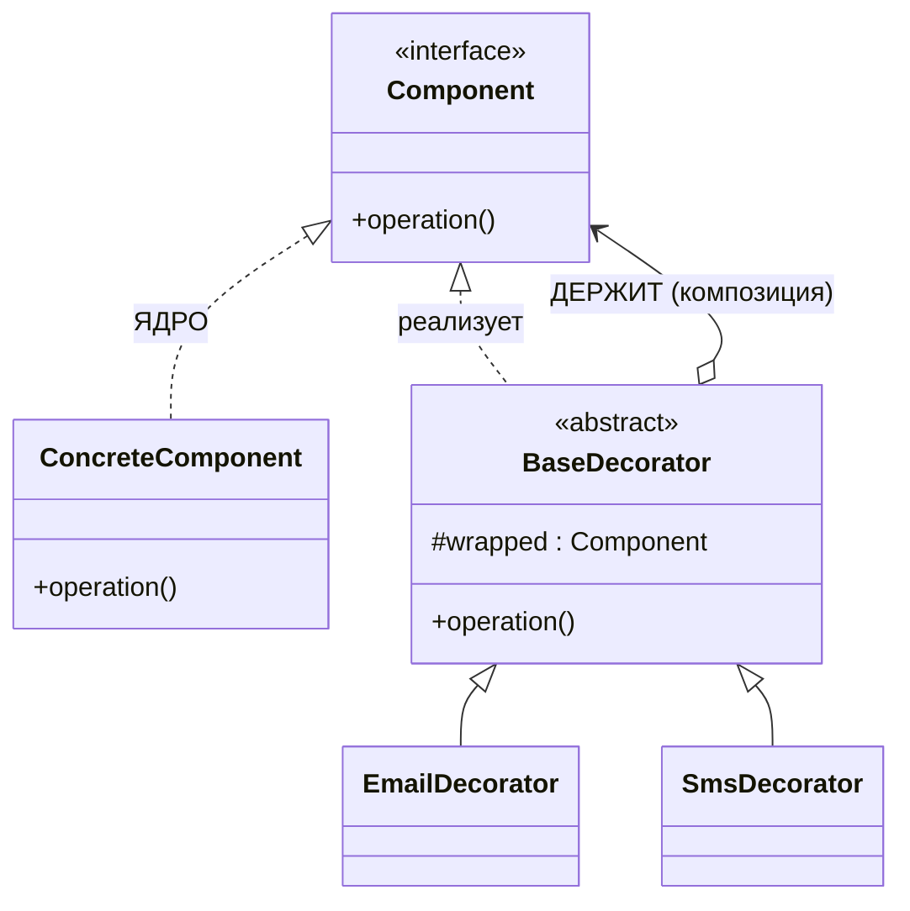

# Золотой урок: паттерн Decorator

> Глубокий разбор одного паттерна — от боли, которая его родила, до прод-нюансов Spring. Читай не спеша, код пробуй в IDE. В конце — задачи и самопроверка.

---

## 0. Одна фраза, которую забери сразу

> **Decorator — это способ добавить объекту поведение, обернув его в другой объект с тем же интерфейсом, вместо того чтобы плодить наследников.**

Ключевое — **«с тем же интерфейсом»**. Именно поэтому обёрнутый объект снаружи неотличим от обычного, его можно передать куда угодно, где ждут базовый тип, и **обернуть ещё раз**. Отсюда вся сила.

---

## 1. Проблема: комбинаторный взрыв классов

Есть уведомление. Надо уметь слать по email. Наследуем:

```java
class Notifier { void send(String msg) { /* базовая отправка */ } }
class EmailNotifier extends Notifier { ... }
```

Приходит требование: «а ещё дублируй в SMS». И понеслось:

```java
class EmailNotifier extends Notifier { }
class SmsNotifier extends Notifier { }
class EmailSmsNotifier extends Notifier { }          // комбинация
class SlackNotifier extends Notifier { }
class EmailSlackNotifier extends Notifier { }        // комбинация
class SmsSlackNotifier extends Notifier { }          // комбинация
class EmailSmsSlackNotifier extends Notifier { }     // комбинация
```

**Считаем боль:**

| Каналов | Классов-комбинаций |
|---|---|
| 2 | 3 |
| 3 | **7** |
| 4 | **15** |
| 5 | **31** |

Это **2ⁿ − 1** — экспоненциальный рост. Добавление **одного** канала почти **удваивает** количество классов. Это и называется **class explosion**.

**Что здесь нарушено:**
- **OCP** — новый канал требует написать лавину новых комбинаций (и не забыть ни одной);
- **DRY** — логика email продублирована в `EmailNotifier`, `EmailSmsNotifier`, `EmailSlackNotifier`…;
- **гибкость** — комбинация зафиксирована **на этапе компиляции**. Хочешь по-разному для разных клиентов? Ещё классы.

Корень проблемы: **наследование — статично**. Ты фиксируешь комбинацию, когда пишешь класс, а не когда создаёшь объект.

---

## 2. Идея: матрёшка вместо иерархии

А что, если вместо «класс на каждую комбинацию» сделать **маленькие кирпичики, которые оборачивают друг друга**?

```java
Notifier n = new SlackDecorator(
                 new SmsDecorator(
                     new EmailDecorator(
                         new BaseNotifier())));
n.send("Зарплата пришла");   // сработают все слои
```

Каждый слой при вызове:
1. зовёт того, кого обернул (внутренняя матрёшка отрабатывает),
2. добавляет **своё**.

**Что изменилось:**

| | Наследование | Decorator |
|---|---|---|
| 4 канала | ~15 классов | **4 декоратора** |
| Комбинация фиксируется | при компиляции | **в рантайме** |
| Новый канал | лавина комбинаций | **1 класс**, старые не тронуты |

> Комбинации больше **не пишутся** — они **собираются** из кирпичиков. Это и есть переход от наследования к композиции.

---

## 3. Анатомия: четыре роли



- **Component** — общий интерфейс. `Notifier`.
- **ConcreteComponent** — базовая реализация, **ядро матрёшки**. `BaseNotifier`.
- **BaseDecorator** — абстрактный декоратор: сам Component **и** держит Component внутри.
- **ConcreteDecorator** — конкретный слой, добавляющий поведение.

```java
interface Notifier {                                  // Component
    void send(String msg);
}

class BaseNotifier implements Notifier {              // ConcreteComponent — ЯДРО
    public void send(String msg) {
        System.out.println("base: " + msg);           // работает САМО, никого не оборачивает
    }
}

abstract class NotifierDecorator implements Notifier {   // BaseDecorator
    protected final Notifier wrapped;                    // ← СЕРДЦЕ: композиция
    protected NotifierDecorator(Notifier wrapped) {
        this.wrapped = wrapped;
    }
}

class EmailDecorator extends NotifierDecorator {         // ConcreteDecorator
    public EmailDecorator(Notifier wrapped) { super(wrapped); }

    @Override
    public void send(String msg) {
        wrapped.send(msg);                               // 1. пусть внутренний отработает
        System.out.println("email: " + msg);             // 2. добавляем СВОЁ
    }
}
```

### Три опоры (пойми, не зубри)

1. **Декоратор реализует тот же интерфейс** → снаружи неотличим от базового объекта → его можно передать куда угодно и обернуть повторно.
2. **Декоратор держит объект внутри** (`wrapped`) → композиция, а не наследование поведения.
3. **Делегирует + добавляет своё** → так слои наслаиваются.

> ⚠️ **Без ядра матрёшка не запускается.** Все декораторы требуют, кого обернуть. В самый центр нужен класс, который реализует интерфейс **напрямую** и работает сам по себе. Забыл `BaseNotifier` — конструкция не собирается.

---

## 4. ⭐ Порядок выполнения: разворот стека

Ключевой вопрос собеса. Для `new EmailDecorator(new SmsDecorator(new BaseNotifier()))`:

```
EmailDecorator.send("Тест")
  └─ wrapped.send()  →  SmsDecorator.send("Тест")
                          └─ wrapped.send()  →  BaseNotifier.send("Тест")
                                                  └─ печатает "base"    ← ПЕРВЫМ
                          └─ печатает "sms"                             ← вторым
  └─ печатает "email"                                                   ← третьим
```

Вывод: **base → sms → email**.

> Вызовы **ныряют вглубь** до ядра (снаружи внутрь), а выполнение **разворачивается наружу** (изнутри наружу). Классический разворот стека вызовов.

### Управление моментом: before / after / around

Порядок зависит от того, **где** стоит `wrapped.send()`:

```java
// AFTER — своё после внутреннего (base → sms → email)
public void send(String msg) {
    wrapped.send(msg);
    System.out.println("email: " + msg);
}

// BEFORE — своё до внутреннего (email → sms → base)
public void send(String msg) {
    System.out.println("email: " + msg);
    wrapped.send(msg);
}

// AROUND — до и после (замеры, транзакции, ретраи)
public void send(String msg) {
    long start = System.currentTimeMillis();
    wrapped.send(msg);                                    // внутренний в середине
    System.out.println("заняло " + (System.currentTimeMillis() - start) + " ms");
}
```

> Декоратор контролирует, добавить поведение **до**, **после** или **вокруг** обёрнутого. Более того — он может **вообще не вызывать** `wrapped` (например, кэш вернул значение и не пошёл дальше). Это делает его мощнее, чем просто «пост-обработка».

---

## 5. Живой пример: кэш + логирование + ретрай

Смотри, как из трёх независимых кирпичиков собирается «умный» сервис:

```java
interface RateService { BigDecimal getRate(String currency); }

class ExternalRateService implements RateService {        // ЯДРО: медленный вызов API
    public BigDecimal getRate(String currency) { /* HTTP */ }
}

class CachingRateService implements RateService {          // слой 1: кэш
    private final RateService wrapped;
    private final Map<String, BigDecimal> cache = new ConcurrentHashMap<>();
    CachingRateService(RateService wrapped) { this.wrapped = wrapped; }

    public BigDecimal getRate(String currency) {
        return cache.computeIfAbsent(currency, wrapped::getRate);
        // ← при попадании в кэш wrapped НЕ вызывается вообще
    }
}

class LoggingRateService implements RateService {          // слой 2: логи + замер (around)
    private final RateService wrapped;
    LoggingRateService(RateService wrapped) { this.wrapped = wrapped; }

    public BigDecimal getRate(String currency) {
        long start = System.currentTimeMillis();
        BigDecimal result = wrapped.getRate(currency);
        System.out.printf("getRate(%s) = %s за %d ms%n",
                currency, result, System.currentTimeMillis() - start);
        return result;
    }
}
```

Сборка — **порядок имеет значение**:

```java
RateService service = new LoggingRateService(new CachingRateService(new ExternalRateService()));
// логирует ВСЕ вызовы, включая попадания в кэш

RateService other = new CachingRateService(new LoggingRateService(new ExternalRateService()));
// логирует только РЕАЛЬНЫЕ походы в API (кэш-хиты не доходят до логгера)
```

> Один и тот же набор слоёв, разный порядок — **разное поведение**. Это гибкость, которой у наследования нет в принципе.

---

## 6. ⭐ Decorator в Spring: разводка бинов

Учебники это не показывают, а на собесе спрашивают. Когда декоратор становится **бином**, появляется проблема: у интерфейса **два** бина, Spring не знает, какой инжектить (`NoUniqueBeanDefinitionException`).

```java
@Service
@Qualifier("stripe")                       // 1. помечаем ЯДРО именем
class StripePaymentGateway implements PaymentGateway {
    public PaymentResult pay(PaymentRequest req) { /* реальный провайдер */ }
}

@Service
@Primary                                    // 2. обёртка — «по умолчанию инжектить МЕНЯ»
class LoggingPaymentGateway implements PaymentGateway {
    private final PaymentGateway wrapped;

    // 3. @Qualifier на ПАРАМЕТРЕ КОНСТРУКТОРА — вложить именно ядро
    public LoggingPaymentGateway(@Qualifier("stripe") PaymentGateway wrapped) {
        this.wrapped = wrapped;
    }

    @Override
    public PaymentResult pay(PaymentRequest req) {
        long start = System.currentTimeMillis();
        PaymentResult result = wrapped.pay(req);
        System.out.printf("Платёж занял %d ms%n", System.currentTimeMillis() - start);
        return result;
    }
}

@RestController
class PaymentController {
    private final PaymentGateway gateway;               // просит ГОЛЫЙ интерфейс
    public PaymentController(PaymentGateway gateway) {  // → получит @Primary (логирующий)
        this.gateway = gateway;                          // и НЕ ЗНАЕТ про логирование
    }
}
```

### Формула (запомни дословно)

> Обёртка → **`@Primary`**. Ядро → **`@Qualifier("name")`**. Внутрь обёртки ядро вкладывается **через конструктор** с `@Qualifier` на параметре.

**Почему `@Qualifier` в конструкторе обязателен:** без него Spring в конструктор `LoggingPaymentGateway` попытается вложить `@Primary`-бин — то есть **сам `LoggingPaymentGateway`** → бин зависит от себя → циклическая зависимость.

> ⚠️ **`@Qualifier` на голом поле без `@Autowired`/конструктора — мёртвая аннотация.** Она *уточняет* инъекцию, но не *создаёт* её. Поле останется `null` → NPE.

### Decorator vs Spring AOP

Резонный вопрос: «зачем руками, если есть `@Around`-аспект?»

| | Decorator (руками) | AOP (`@Aspect`) |
|---|---|---|
| Видимость | явно в коде, читаемо | «магия», не видно в месте вызова |
| Гибкость | разный порядок слоёв для разных сборок | pointcut'ы, `@Order` |
| Типобезопасность | компилятор проверяет | строковые выражения pointcut |
| Много точек применения | много бойлерплейта | одна аннотация на всё |

> Правило: **точечно и явно** (1–3 места, важна читаемость) → Decorator. **Сквозная функциональность** (логи/метрики/транзакции на сотнях методов) → AOP. Кстати, Spring AOP внутри создаёт **прокси** — идейно тот же приём обёртки.

---

## 7. Decorator в JDK (узнавай в дикой природе)

**`java.io` — учебник по Decorator целиком:**

```java
Reader r = new BufferedReader(                  // + буферизация
               new InputStreamReader(           // (это уже Adapter: байты → символы)
                   new FileInputStream("f.txt")));   // ← ядро

OutputStream out = new GZIPOutputStream(        // + сжатие
                       new BufferedOutputStream(     // + буфер
                           new FileOutputStream("f.gz")));   // ← ядро
```

Каждая обёртка добавляет способность, интерфейс сохраняется — можно вкладывать в любом порядке.

**Другие:**
- `Collections.unmodifiableList(list)` / `synchronizedList(list)` — обёртки, добавляющие неизменяемость / синхронизацию;
- `HttpServletRequestWrapper` в Spring/Servlet API — обёртка над запросом;
- `Stream.filter().map()` — идейно цепочка обёрток над источником.

---

## 8. ⭐ Decorator vs двойники (ловушки собеса)

| | Меняет интерфейс? | Цель | Кто работает |
|---|---|---|---|
| **Decorator** | нет | **добавить поведение** | **все** слои |
| **Adapter** | **да** | совместимость | все (но слой один) |
| **Proxy** | нет | **контроль доступа** | все |
| **Chain of Responsibility** | нет | найти обработчика | **один** (потом стоп) |
| **Strategy** | — | подменить алгоритм | один (замена, не слой) |

### Decorator vs Adapter

> **Decorator меняет поведение, сохраняя интерфейс. Adapter меняет интерфейс, сохраняя поведение.**

Противоположные оси. Именно поэтому декораторы **вкладываются** друг в друга (интерфейс один и тот же), а адаптеры — нет.

### Decorator vs Proxy ⭐ (самая тонкая пара)

Структура **идентична**: тот же интерфейс, объект внутри, делегирование. Разница в **намерении**:

- **Decorator** — **добавляет** функциональность. Клиент осознанно собирает слои: `new Caching(new Logging(core))`. Смысл в **накоплении**.
- **Proxy** — **контролирует доступ** к объекту: ленивая инициализация, права, удалённый вызов, транзакция. Клиент часто **не знает**, что работает с прокси, и объект обычно **один** (не собирают цепочки).

> Формула: **Decorator — «добавь мне ещё умений». Proxy — «решай, пускать ли меня к объекту».** Spring `@Transactional` — это Proxy, а не Decorator.

### Decorator vs Chain of Responsibility

> **Decorator — все слои работают и накапливают. CoR — идёт поиск обработчика, и цепочка останавливается на том, кто справился.**

Метафора: Decorator — одеться (майка + рубашка + куртка, **все** греют). CoR — эскалация в поддержке (оператор → старший → менеджер, **останавливается** на решившем). Spring Security filter chain — это CoR.

### Decorator vs Strategy

Strategy **заменяет** алгоритм целиком (один вместо другого). Decorator **наслаивает** поведение поверх существующего (и то, и это). Замена vs наслоение.

---

## 9. Когда НЕ надо

- **Слой всегда один и он обязателен** — проще встроить в сам класс.
- **Комбинации не нужны** — если email+sms никогда не сочетаются, хватит Strategy (выбор одного из).
- **Слоёв стало 5+** — отладка превращается в кошмар, стек-трейсы нечитаемы, «а кто у нас там в третьей матрёшке?».
- **Декоратор меняет контракт** — если обёртка нарушает ожидания от базового интерфейса (бросает новые исключения, меняет семантику), она ломает **LSP**, и клиент сломается.
- **Нужна сквозная функциональность на сотнях методов** — это AOP, а не ручные обёртки.

> Признак здорового декоратора: он **прозрачен** — клиент может не знать про обёртку, и всё продолжает работать.

---

## 10. Как Decorator реализует SOLID

- **OCP** — новый слой = новый класс; ни ядро, ни другие декораторы не трогаются. Самый яркий пример OCP среди паттернов.
- **SRP** — каждый декоратор делает **одну** вещь (кэш / лог / ретрай), а не всё сразу.
- **LSP** — декоратор реализует тот же интерфейс и подставляется везде, где ждут базовый тип. Если он ломает ожидания — это баг паттерна.
- **DIP** — все работают с интерфейсом `Component`, никто не знает конкретных классов.
- **Композиция > наследование** — **эталонный** пример: наследование дало бы 2ⁿ классов, композиция даёт n.

---

## 11. Частые ошибки

1. **Нет ядра (ConcreteComponent)** — все классы обёртки, матрёшку не с чего начать.
2. **`public` поле `wrapped`** — снаружи лезут во внутренности. Только `protected final` (или `private final` в конкретном декораторе).
3. **Декоратор не реализует общий интерфейс**, а наследует конкретный класс — теряется взаимозаменяемость и возможность вложения.
4. **Забыл вызвать `wrapped.method()`** — цепочка рвётся, внутренние слои молча не работают.
5. **Состояние в декораторе + синглтон-бин** — если декоратор хранит per-request данные, шаренный бин сломается под нагрузкой.
6. **`@Qualifier` на голом поле** в Spring — инъекции не будет, поле `null`.
7. **Забыл `@Primary`** на обёртке → `NoUniqueBeanDefinitionException`, или наружу поедет ядро без слоя.
8. **Слишком много слоёв** — отладка и стек-трейсы становятся нечитаемыми.

---

## 12. Вопросы собеса (с ответами)

**«Что такое Decorator и какую проблему решает?»**
> Структурный паттерн: обёртка с тем же интерфейсом, которая делегирует обёрнутому объекту и добавляет поведение. Решает class explosion — при n возможностях наследование требует до 2ⁿ классов комбинаций, декораторы обходятся n, а комбинация собирается в рантайме.

**«Почему декоратор обязан реализовать тот же интерфейс?»**
> Чтобы быть неотличимым от базового объекта: его можно передать везде, где ждут интерфейс, и **обернуть повторно**. Без этого вложенность невозможна.

**«Чем Decorator отличается от Proxy?»**
> Структура одинаковая, намерение разное. Decorator добавляет функциональность, слои осознанно собирает клиент, их бывает несколько. Proxy контролирует доступ (ленивость, права, транзакция), клиент часто не знает о нём, объект один.

**«Чем от Adapter?»**
> Decorator сохраняет интерфейс и меняет поведение; Adapter меняет интерфейс и сохраняет поведение.

**«Чем от Chain of Responsibility?»**
> В Decorator работают **все** слои и накапливают эффект. В CoR запрос идёт до первого, кто способен обработать, и там останавливается.

**«Пример из JDK?»**
> `java.io`: `new BufferedReader(new InputStreamReader(new FileInputStream(...)))`. Также `Collections.unmodifiableList()` / `synchronizedList()`.

**«Как собрать декоратор из бинов в Spring?»**
> Обёртка — `@Primary`, ядро — `@Qualifier("name")`, вложение через конструктор с `@Qualifier` на параметре. Иначе Spring вложит `@Primary`-бин, то есть саму обёртку → цикл.

**«Decorator или AOP?»**
> Точечно и явно, когда важна читаемость и порядок — Decorator. Сквозная функциональность на множестве методов — AOP (который сам внутри строит прокси).

**«Влияет ли порядок обёрток?»**
> Да. `Logging(Caching(core))` логирует все вызовы, `Caching(Logging(core))` — только промахи кэша. Одни и те же слои, разное поведение.

---

## 13. Задачи (по нарастанию, делай в IDE до зелёной сборки)

**Уровень 1 — классика.** `Beverage { String description(); double cost(); }`, ядро `Espresso` (300). Декораторы `Milk` (+50), `Syrup` (+70), `WhippedCream` (+90) — каждый наслаивает **и цену, и описание**. Собери `Espresso + Milk + Syrup`, проверь: `"Espresso, Milk, Syrup"` и `420`.

**Уровень 2 — порядок и before/after.** Добавь декоратор `Discount10Percent`. Собери две цепочки: скидка снаружи добавок и скидка внутри. Объясни, почему суммы разные.

**Уровень 3 — around.** `RateService` с ядром, которое «медленно» отвечает (`Thread.sleep(200)`). Напиши `CachingRateService` и `TimingRateService`. Собери в двух порядках, вызови дважды подряд и **объясни разницу в логах**.

**Уровень 4 — Spring.** `PaymentGateway` + ядро `StripePaymentGateway` + декоратор `LoggingPaymentGateway` как бины. Разведи `@Primary`/`@Qualifier`, контроллер инжектит голый интерфейс. Проверь, что логи появляются, а контроллер про них не знает.

**Уровень 5 — два слоя бинов.** Добавь второй декоратор (`RetryingPaymentGateway`) поверх логирующего. Подумай: как теперь развести три бина одного интерфейса? (подсказка: `@Primary` только на **внешнем**, остальные — по `@Qualifier`).

---

## 14. Проверь себя (закрой файл, ответь вслух)

1. Что такое class explosion и сколько классов нужно при 4 возможностях?
2. Четыре роли паттерна — назови и объясни каждую.
3. Почему без ConcreteComponent (ядра) матрёшка не работает?
4. В каком порядке выполнятся слои и почему? Как его перевернуть?
5. Приведи случай, когда декоратор **не вызывает** `wrapped`.
6. Decorator vs Proxy — структура одна, разница в чём?
7. Decorator vs Adapter — что меняется, что сохраняется?
8. Decorator vs Chain of Responsibility — кто работает?
9. Формула разводки декоратора-бина в Spring — какая аннотация где и почему?
10. Когда лучше AOP, а не Decorator?

> Ответил на все десять своими словами — Decorator у тебя понят, а не выучен.
