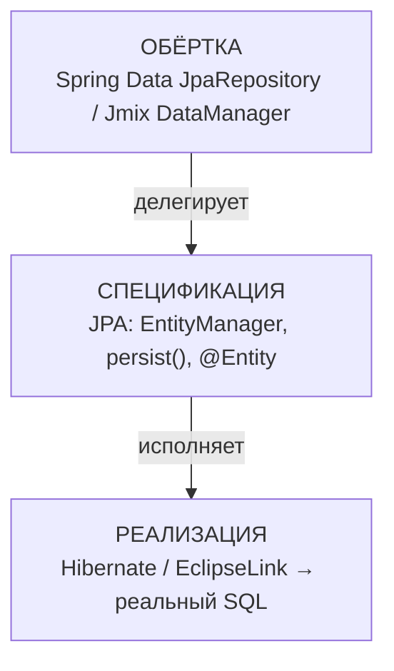

# Золотой конспект: базовые понятия JPA (фундамент)

> Термины-«клей», которые связывают всё остальное в JPA. Если механики (Persistence Context, N+1, кэши) — это «как оно работает», то этот файл — «что это вообще за слова и как они соотносятся». Читай, закрывай, вспоминай своими словами.

---

## 1. ORM — мост между двумя мирами

**ORM (Object-Relational Mapping)** = переводчик между **миром объектов** (Java) и **миром реляционных таблиц** (SQL). Эти миры устроены по-разному:

| Мир объектов (Java) | Мир таблиц (SQL) |
|---|---|
| класс `Student` | таблица `student` |
| поле `username` | колонка `username` |
| ссылка `Department department` | колонка `department_id` (FK, просто UUID) |
| `List<Student> students` | строки с foreign key |
| наследование | (нет прямого аналога) |

Объект держит **ссылку** на живой `Department`; таблица держит **число** `department_id`. ORM переводит одно в другое **автоматически**.

**Что ORM берёт на себя:**
- объект → строка (при сохранении): `student.department` → `department_id = '...'`;
- строка → объект (при чтении): `department_id` → ссылка `getDepartment()`;
- java-типы ↔ SQL-типы (`String` ↔ `VARCHAR`, `BigDecimal` ↔ `NUMERIC`);
- связи (`@ManyToOne`) ↔ foreign keys и join'ы;
- JPQL (объектный запрос) → SQL.

**Боль без ORM** — ручной JDBC на каждую сущность:
```java
String sql = "INSERT INTO student (id, username, department_id) VALUES (?, ?, ?)";
PreparedStatement ps = connection.prepareStatement(sql);
ps.setObject(1, student.getId());
ps.setString(2, student.getUsername());
ps.setObject(3, student.getDepartment().getId());   // сам вытаскиваешь FK
ps.executeUpdate();
// а при чтении — ResultSet, вручную собирать объект из колонок...
```

**С ORM:**
```java
em.persist(student);   // ORM сам построил INSERT, вытащил FK, отправил
```

**Минусы ORM (спрашивают «когда плох?»):**
- скрывает SQL → легко случайно породить N+1 или тяжёлые джойны;
- сложная аналитика/отчёты пишутся коряво → там лучше нативный SQL;
- **object-relational impedance mismatch** — миры объектов и таблиц не совпадают идеально, ORM «протекает» на наследовании и сложных случаях.

> **ORM** = переводчик объект↔таблица. Избавляет от ручного JDBC. Хорош для 90% CRUD-работы, слаб на тяжёлой аналитике (там нативный SQL).

**Проверь себя:**
1. Какие два мира соединяет ORM и чем они отличаются?
2. Что конкретно ORM переводит (3 примера)?
3. Когда ORM — плохой выбор?

---

## 2. JPA vs Hibernate vs EclipseLink

- **JPA** — **спецификация** (контракт, набор интерфейсов): `@Entity`, `EntityManager`, `persist()`. Сама ничего не делает.
- **Hibernate / EclipseLink** — **реализации** JPA (конкретные ORM-инструменты), которые реально генерят SQL. Взаимозаменяемы.
- **ORM** — общая категория (переводчик); JPA — стандарт на ORM в Java; Hibernate/EclipseLink — сами ORM-инструменты.

> Аналогия: **JPA — как интерфейс `List`. Hibernate/EclipseLink — как `ArrayList`/`LinkedList`** (разные реализации одного контракта).

**Доказательство, что JPA — спецификация:** один и тот же код работает на любой реализации, провайдер меняется **в конфиге**:
```xml
<!-- Hibernate -->
<provider>org.hibernate.jpa.HibernatePersistenceProvider</provider>
<!-- ИЛИ EclipseLink — Java-код em.persist(s) не меняется ни на символ -->
<provider>org.eclipse.persistence.jpa.PersistenceProvider</provider>
```

**Проверь себя:**
1. JPA — спецификация или реализация?
2. Назови две реализации JPA.
3. Как переключить реализацию, не меняя Java-код?

---

## 3. ⭐ Три слоя доступа к данным

Ключ к пониманию всей архитектуры. Три уровня, у каждого своя роль:



| Слой | Что это | Пример в коде | Роль |
|---|---|---|---|
| **Обёртка** | удобный инструмент | `repository.save()` / `dataManager.load()` | избавляет от boilerplate, **сам SQL не делает** |
| **Спецификация** | контракт JPA | `EntityManager`, `persist()`, `@Entity` | стандарт, интерфейсы |
| **Реализация** | ORM-провайдер | (скрыт, работает под капотом) | **реально генерит и шлёт SQL** |

**Признак, как отличить реализацию:** «кто **реально делает SQL**». Обёртка перекладывает вниз, реализация — исполняет.

**Три слоя в одном вызове `studentRepository.save(s)`:**
```
studentRepository.save(s)      ← ОБЁРТКА (Spring Data JPA)
      ↓ внутри зовёт
entityManager.merge(s)          ← СПЕЦИФИКАЦИЯ (JPA)
      ↓ исполняет
Hibernate → INSERT/UPDATE       ← РЕАЛИЗАЦИЯ
```

**Дефолты:**
- **Spring Boot + Spring Data JPA** → реализация по умолчанию **Hibernate**;
- **Jmix + DataManager** → реализация **EclipseLink**.

**Два важных вывода:**
- **Hibernate работает БЕЗ обёртки** — можно голый JPA + Hibernate, без Spring Data (реализация самодостаточна);
- **Обёртка НЕ работает без реализации** — Spring Data сам SQL не делает, ему нужен провайдер снизу.

> Метафора (заказ еды): **обёртка** = приложение доставки (жмёшь кнопку), **спецификация** = стандартный формат заказа на кухню, **реализация** = повар, который готовит. Приложение само не готовит — передаёт заказ повару.

**Проверь себя:**
1. Три слоя — назови и укажи роль каждого.
2. По какому признаку определяешь реализацию?
3. Может ли Hibernate работать без Spring Data? А Spring Data без реализации?
4. Дефолтные реализации для Spring Boot и для Jmix?

---

## 4. Персистентность

**Персистентность (persistence)** = сохраняемость, способность данных **пережить завершение программы**.

- обычный объект живёт в **оперативной памяти** → выключил приложение, исчез;
- **персистентный** объект → сохранён в **БД** → переживёт перезапуск.

Отсюда все термины:
- **Persistence Context** = «контекст сохраняемости», управляет объектами, связанными с БД;
- **`persist()`** = «сделать персистентным» = начать сохранение transient-объекта в БД;
- **JPA** = Java **Persistence** API = API для сохраняемости.

> Метафора: обычный объект — мысль в голове (исчезнет). Персистентный — записанная в блокнот мысль (останется). `persist()` — акт записи.

**Проверь себя:**
1. Что значит «персистентный»?
2. Почему Persistence Context так называется?

---

## 5. Прокси

**Прокси (proxy)** = объект-заместитель. Снаружи выглядит как настоящий, но стоит «перед» ним, перехватывает обращения и добавляет поведение. В JPA — в **двух** местах:

### Прокси №1 — ленивая связь (lazy proxy)

Когда связь `LAZY`, вместо реального объекта подставляется **прокси-заглушка** того же типа, но пустая:

```java
Employee e = repository.findById(1L).get();
Department d = e.getDepartment();   // это ПРОКСИ, пустой, SQL не было
d.getName();                         // ← первое обращение к полю → прокси идёт в БД и грузит
```

> Отсюда `LazyInitializationException`: тронул прокси вне транзакции → грузить некому → взрыв. Теперь механизм ясен до конца.

### Прокси №2 — Spring-бины (AOP proxy)

Spring оборачивает бин в прокси, который делает обвязку **вокруг** метода:

```
твой код → ПРОКСИ (открыть транзакцию) → [настоящий метод] → (закоммитить)
```

Отсюда ограничения `@Transactional`:
- перехватывает только **`public`**-методы;
- **self-invocation**: вызов `this.method()` изнутри того же класса идёт **мимо прокси** → транзакция не откроется (прокси стоит снаружи, внутренний вызов до него не доходит).

> **Прокси** = заместитель, перехватывающий обращения (ленивую загрузку или транзакцию) и делегирующий настоящему объекту. Это паттерн **Proxy**: тот же интерфейс + объект внутри + контроль доступа.

**Проверь себя:**
1. Что такое прокси и где он в JPA (два места)?
2. Как прокси объясняет `LazyInitializationException`?
3. Почему self-invocation ломает `@Transactional`?

---

## 6. Flush — с примерами

**Flush** = синхронизация Persistence Context с БД: dirty checking + **отправка накопленного SQL** в базу (в рамках транзакции). **Flush ≠ commit** (flush шлёт SQL, commit фиксирует и делает видимым другим).

**Триггеры:** перед commit · перед JPQL-запросом · явный `flush()`.

**Пример A — авто перед коммитом:**
```java
@Transactional
public void raise(Long id) {
    Employee e = repository.findById(id).get();
    e.setSalary(new BigDecimal("500000"));   // копится, SQL нет
}   // ← FLUSH перед коммитом → UPDATE уходит, потом COMMIT
```

**Пример B — авто перед JPQL:**
```java
e.setSalary(BigDecimal.ZERO);                    // изменение в контексте
List<Employee> zeros = em.createQuery(           // ← FLUSH перед этим SELECT,
    "SELECT e FROM Employee e WHERE e.salary = 0", ...);   // чтобы запрос увидел salary=0
```

**Пример C — явный flush (получить сгенерированный id раньше):**
```java
em.persist(order);   // id ещё null, INSERT не ушёл
em.flush();          // ← форсируем INSERT → БД сгенерировала id
auditService.log("Заказ " + order.getId());   // id уже нужен здесь
```

**Пример D — flush + clear в батче (тебе близко: scatter-gather):**
```java
for (int i = 0; i < list.size(); i++) {
    em.persist(list.get(i));
    if (i % 50 == 0) {
        em.flush();    // отправить пачку
        em.clear();    // очистить контекст → освободить память (объекты станут detached)
    }
}
```

> После flush изменения **видны только твоей транзакции** (read-your-own-writes). Другие увидят только после **commit**.

**Проверь себя:**
1. Flush ≠ commit — в чём разница?
2. Три триггера flush?
3. Зачем нужен явный `flush()` (два кейса)?
4. После flush видит ли изменения другая транзакция?

---

## 7. Fetch plan в Jmix (твой стек)

Fetch plan = «что подтянуть сразу» (аналог `JOIN FETCH`/`@EntityGraph` в чистом JPA). Всё, что не в плане, — ленивое.

| План | Что тянет |
|---|---|
| **`LOCAL`** (`_local`) | только простые поля сущности, БЕЗ связей |
| **`INSTANCE_NAME`** (`_instance_name`) | только поля для `@InstanceName` (подпись объекта) |
| **`BASE`** (`_base`) | LOCAL + INSTANCE_NAME каждой связи (сам объект + имена соседей) |

**Ключевой вывод:** взрыв/N+1 зависит **не от плана вообще, а от конкретного поля** — загрузил ли план именно то поле, к которому обращаешься.

```java
// Student загружен с BASE. Department.name имеет @InstanceName, budget — нет.
student.getDepartment().getName();    // ✅ ok — name подтянут через BASE (из памяти)
student.getDepartment().getBudget();  // 💥 LazyInitializationException — budget не в BASE
```

Нужно больше — кастомный план:
```java
dataManager.load(Student.class).all()
    .fetchPlan(fp -> fp.addFetchPlan(FetchPlan.LOCAL)
                       .add("department.name")
                       .add("department.budget"))   // явно тянем нужное
    .list();
```

> Fetch plan в Jmix = что подтянуть заранее = лекарство от lazy-взрывов и N+1, ровно как `JOIN FETCH` в Spring. Один механизм, два мира.

**Проверь себя:**
1. Три встроенных fetch plan и что каждый тянет?
2. От чего зависит, взорвётся связь или нет — от плана вообще или от конкретного поля?
3. Чему соответствует fetch plan в чистом JPA?

---

## Финальный самотест (базовые понятия)

1. Что такое ORM и какие два мира он соединяет?
2. JPA / Hibernate / EclipseLink — кто спецификация, кто реализация?
3. Три слоя доступа к данным — назови и укажи роль каждого. По какому признаку определяешь реализацию?
4. Что значит «персистентность»?
5. Что такое прокси и в каких двух местах JPA он встречается?
6. Flush ≠ commit — в чём разница? Три триггера flush?
7. LOCAL / BASE / INSTANCE_NAME — что тянет каждый?
8. Дефолтные реализации: Spring Boot → ? Jmix → ?

> Отвечаешь на все восемь своими словами — фундамент JPA у тебя целостный, без дыр.
