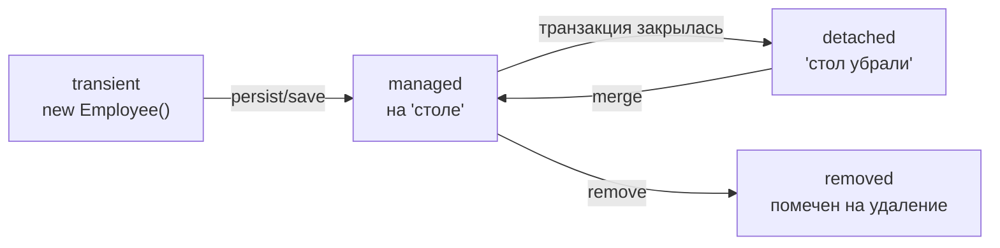

# Золотой конспект: JPA / Hibernate

> Всё, что нужно для банковского собеса (Kaspi, Halyk, локальные компании KZ). Формат: **боль → механизм → формула на собес**. В конце каждого блока — «Проверь себя»: читай, закрывай файл, вспоминай своими словами.

---

## 0. JPA vs Hibernate vs EclipseLink

- **JPA** — это **спецификация** (набор интерфейсов и правил): `@Entity`, `EntityManager`, `@OneToMany`. Сама по себе ничего не делает.
- **Hibernate / EclipseLink** — **реализации** JPA (провайдеры), которые реально переводят Java ↔ SQL.
- **ORM** (Object-Relational Mapping) — общая идея «переводчика» между миром объектов и миром таблиц.

> Аналогия: JPA — как интерфейс `List`, Hibernate/EclipseLink — как `ArrayList`/`LinkedList` (конкретные реализации). В твоём проде провайдер — **EclipseLink**, но роль та же.

---

## 1. ⭐ Persistence Context — сердце всего

Главное открытие, ломающее интуицию новичка:

> `save()` и изменение полей сущности **обычно НЕ отправляют SQL в базу сразу.** Изменения копятся в памяти — в **Persistence Context** — и уходят в БД пачкой позже, на **flush** (обычно при коммите).

```java
@Transactional
public void raise(Long id) {
    Employee e = repository.findById(id).get();
    e.setSalary(new BigDecimal("500000"));   // save() НЕ звали
}   // ← UPDATE всё равно уйдёт при коммите. Магия? Нет — dirty checking.
```

**Persistence Context = «рабочий стол» в памяти между кодом и базой.** Три выгоды, зачем он нужен:

1. **Батчинг** — 5 изменений одного объекта → **один** UPDATE, а не 5. Меньше обращений к БД.
2. **Кэш L1 + идентичность** — повторный `findById(1L)` в той же транзакции не идёт в БД и возвращает **тот же объект** (`e1 == e2` → true).
3. **Согласованность** — правильный порядок операций (родитель до детей из-за FK), всё в одной транзакции.

**Проверь себя:**
1. Почему `save()` не всегда шлёт SQL сразу?
2. Три выгоды Persistence Context?
3. Почему второй `findById(1L)` в одной транзакции не идёт в БД?

---

## 2. ⭐ Жизненный цикл сущности



| Состояние | Что это | В БД? | Отслеживается? |
|---|---|---|---|
| **transient** | новый объект (`new`) | нет | нет |
| **managed** | «на столе», внутри транзакции | да/будет | **да** (dirty checking) |
| **detached** | был managed, транзакция закрылась | да | **нет** |
| **removed** | помечен на удаление | пока да | да |

> Граница: транзакция закончилась → **Persistence Context уничтожается** → все объекты становятся **detached**. Живут дальше как обычные объекты с данными, но отслеживание и дозагрузка не работают.

**Managed vs detached метафора:** managed — **прямой эфир** (Hibernate видит каждое изменение). Detached — **скриншот** (данные есть, но связь с базой оборвана).

**Проверь себя:**
1. Четыре состояния — назови и объясни.
2. Что происходит с объектом, когда транзакция закрылась?
3. Чем managed отличается от detached?

---

## 3. ⭐ LazyInitializationException + граница транзакции

**Самый частый баг JPA.** Возникает, когда трогаешь **ленивую** связь у **detached**-объекта вне транзакции.

```java
@Transactional
public Employee load(Long id) {
    return repository.findById(id).get();   // department LAZY, не загружен
}   // ← транзакция закрыта, объект detached

// контроллер (транзакции НЕТ):
e.getDepartment().getName();   // 💥 LazyInitializationException
```

### Граница транзакции = вход/выход из `@Transactional`-метода

> Внутри `@Transactional` (обычно метод сервиса) — объекты managed, лень грузится. Снаружи (контроллер) — detached, лень взрывается.

**Три условия взрыва — нужны ВСЕ три сразу:**
1. связь **ленивая**, +
2. её **не загрузили** в транзакции, +
3. трогаешь **вне** живого контекста.

Убери любое одно → взрыва нет.

### Ловушки границы

- **Нет `@Transactional`** → каждый вызов репозитория = своя микро-транзакция, объект сразу detached.
- **`@Transactional` работает через прокси** → только `public`-методы; **self-invocation** (вызов `@Transactional`-метода изнутри того же класса) **игнорируется**.
- **`open-in-view`** (по умолчанию `true` в Spring Boot) → тайком держит контекст до конца HTTP-ответа, маскируя проблему. **Антипаттерн.**

### Как чинить (по приоритету)

1. **`JOIN FETCH`** — явный запрос с джойном;
2. **`@EntityGraph`** — декларативно (= Jmix fetch plan);
3. **DTO-маппинг внутри транзакции** — не выпускать сущность наружу;
4. ~~`open-in-view`~~ — работает, но антипаттерн.

**Проверь себя:**
1. Три условия, при которых происходит `LazyInitializationException`?
2. Где граница транзакции?
3. Что такое self-invocation и почему `@Transactional` там не работает?
4. Почему `open-in-view` — антипаттерн?

---

## 4. ⭐⭐ N+1 — проклятие №1 на собесе

```java
List<Employee> employees = repository.findAll();   // 1 запрос
for (Employee e : employees) {
    e.getDepartment().getName();                   // N запросов (по одному на строку)
}
// 100 сотрудников → 1 + 100 = 101 запрос вместо ОДНОГО
```

> **N+1** = 1 запрос на список + N запросов на догрузку ленивой связи у каждого = **1+N** обращений. Приложение работает, тесты на 3 записях зелёные, а в проде на объёмах — колом.

**Обнаружить:** лог SQL (`spring.jpa.show-sql=true` / `org.hibernate.SQL=DEBUG`) → пачка одинаковых SELECT'ов.

**Починить:**
```java
@Query("SELECT e FROM Employee e JOIN FETCH e.department")   // 1 запрос с JOIN
List<Employee> findAllWithDepartment();
```
- `JOIN FETCH` — один запрос с джойном;
- `@EntityGraph(attributePaths = {"department"})` — то же декларативно;
- `@BatchSize(size = 50)` — грузит ленивые связи пачками (`WHERE id IN (...)`), ~3 запроса вместо 101.

> ⚠️ **EAGER НЕ лечит N+1** — часто сам его создаёт (неотключаемо). Лекарство — `JOIN FETCH`/`@EntityGraph`, а не смена fetch-типа.

**Проверь себя:**
1. Что такое N+1 и откуда берётся формула 1+N?
2. Как обнаружить?
3. Три способа починить?
4. Правда ли, что EAGER лечит N+1?

---

## 5. ⭐ Lazy vs Eager

- **EAGER** — грузить связь **сразу**, в том же запросе.
- **LAZY** — грузить **потом**, при первом обращении к связи (до этого — прокси-заглушка).

### Правила по умолчанию (спрашивают дословно)

> **To-One → EAGER, To-Many → LAZY.**

| Аннотация | Default | Логика |
|---|---|---|
| `@ManyToOne` | **EAGER** | одна строка — дёшево, тянем сразу |
| `@OneToOne` | **EAGER** | одна строка |
| `@OneToMany` | **LAZY** | коллекция — дорого, отложим |
| `@ManyToMany` | **LAZY** | коллекция |

### Почему глобальный EAGER — зло (3 причины)

1. **Тянет пол-базы** — каскад EAGER-связей вытягивает граф на пол-схемы на каждый запрос.
2. **Не лечит N+1** — часто усугубляет, и неотключаемо.
3. **Нет контроля** — EAGER нельзя выключить для конкретного запроса.

### Золотое правило

> **LAZY на всё** (включая `@ManyToOne`, переопределяя дефолт) + нужные связи точечно через `JOIN FETCH`/`@EntityGraph`. «Ленись по умолчанию, будь жадным точечно.»

```java
@ManyToOne(fetch = FetchType.LAZY)   // переопределяем дефолтный EAGER
private Department department;
```

**Проверь себя:**
1. Дефолты для четырёх типов связей?
2. Три причины, почему глобальный EAGER плох?
3. Как правильно бороться с ленью?

---

## 6. ⭐ Транзакции: flush + dirty checking

### Dirty checking

> Managed-сущность получает **снимок** (snapshot) при загрузке. Перед flush Hibernate **сравнивает** поля со снимком → генерит `UPDATE` только для изменённых. Явный `save` для managed **не нужен**.

Цена: держатся две копии объекта (текущая + снимок). Поэтому 100k сущностей в одном контексте — дорого.

### Flush — отправка накопленного SQL

> **Flush ≠ commit.** Flush **отправляет** SQL в БД (в рамках транзакции). Commit **фиксирует** и делает изменения видимыми другим.

**Три триггера flush (спрашивают):**
1. перед **commit**;
2. перед выполнением **JPQL/HQL-запроса** (чтобы SELECT увидел свежие данные);
3. явный `entityManager.flush()`.

> ⚠️ **Flush ≠ видимость для других.** После flush SQL отправлен, но заперт в транзакции до **commit**. Другая транзакция изменения не видит (при READ_COMMITTED).

### Dirty checking vs Dirty read — не путать!

| | Dirty checking | Dirty read (грязное чтение) |
|---|---|---|
| Что это | внутренний механизм Hibernate «поле изменилось → записать» | транзакция A читает НЕзакоммиченное из B |
| Транзакций | **одна** | **две** |
| Про что | про запись | про изоляцию БД |

> **Read-your-own-writes** (транзакция видит свои незакоммиченные изменения) — это **норма**, НЕ грязное чтение. Грязное чтение — только когда ДРУГАЯ транзакция видит твоё незакоммиченное.

**Проверь себя:**
1. Как Hibernate узнаёт, что поле изменилось (без `save`)?
2. Три триггера flush?
3. Flush ≠ commit — в чём разница?
4. Dirty checking vs dirty read — сколько транзакций в каждом?

---

## 7. ⭐ Кэши L1 / L2

| | L1 | L2 |
|---|---|---|
| Что | = Persistence Context | общий кэш приложения (SessionFactory) |
| Область | одна сессия/транзакция | всё приложение |
| По умолчанию | **включён**, нельзя выключить | **выключен**, включать явно |
| Живёт | пока транзакция | между транзакциями |
| Общий между сессиями | нет (приватный) | да |
| Хранит | сами объекты (идентичность `==`) | сырые данные (пересобирает) |
| Кому | всем, всегда | **только read-mostly справочникам** |

```java
@Entity
@Cacheable
@Cache(usage = CacheConcurrencyStrategy.READ_WRITE)
class Currency { ... }   // справочник — да. Account (баланс) — НЕТ.
```

> **L1 — для всех, всегда, автоматически** (не выбор). **L2 — опциональная надстройка** только на стабильных справочниках (Currency — да, Account — нет). Выбор стоит «включать L2 для сущности или нет», а не «L1 vs L2».

**Подвохи:**
- L1 кэширует по `@Id` (`findById`); **JPQL-запрос L1 не проверяет** перед выполнением.
- L2 **устаревает**, если данные меняют в обход Hibernate (нативный SQL, другой сервис).
- **Query cache** — отдельный, кэширует результаты запросов, работает только с L2, капризный.

**Проверь себя:**
1. Что такое L1 и почему его нельзя выключить?
2. Чем L2 отличается от L1 (область, дефолт, что хранит)?
3. Currency vs Account — что в L2 и почему?

---

## 8. ⭐ Связи и подводные камни

### Owning side (кто управляет FK)

В БД связь = **одна** FK-колонка (`employee.department_id`). В Java — **две** стороны.

```java
class Employee {
    @ManyToOne
    private Department department;          // OWNING side (нет mappedBy) — управляет FK
}
class Department {
    @OneToMany(mappedBy = "department")
    private List<Employee> employees;       // INVERSE side (есть mappedBy) — только чтение
}
```

> **Owning side (без `mappedBy`) управляет FK.** Hibernate смотрит только на неё при сохранении. Изменения на inverse side **игнорируются** для SQL.

```java
department.getEmployees().add(employee);   // ⚠️ inverse — в БД НЕ запишется!
employee.setDepartment(department);         // ✅ owning — FK запишется
```
Best practice — helper-метод, синхронизирующий обе стороны:
```java
public void addEmployee(Employee e) {
    employees.add(e);          // память
    e.setDepartment(this);     // БД (owning)
}
```

### Каскады — распространять операцию с родителя на детей

| Тип | Операция | Результат на детях |
|---|---|---|
| **PERSIST** | сохранение нового | INSERT детей |
| **MERGE** | слияние detached | INSERT если новый / UPDATE если есть id |
| **REMOVE** | удаление родителя | DELETE детей |
| **ALL** | все сразу (+ REFRESH, DETACH) | всё вышеперечисленное |

> По умолчанию **каскадов нет** — каждую сущность сохраняешь/удаляешь явно. Ставь каскады на «родитель → дети» (`@OneToMany`), **не** на `@ManyToOne` (иначе удаление ребёнка снесёт родителя). `ALL`/`REMOVE` — только для строго зависимых детей.

```java
save(orderWithNewItems);   // без PERSIST → TransientObjectException
                            // (ссылка на несохранённые transient-дети)
```

### orphanRemoval — удаление сироты

> `orphanRemoval = true` — ребёнок удаляется, когда его **убрали из коллекции** родителя (родитель жив).
> Отличие от `REMOVE`: REMOVE срабатывает при удалении **родителя**, orphanRemoval — при **разрыве связи**.

```java
order.getItems().remove(item);
// orphanRemoval=true → DELETE item ✅ (родитель жив!)
// CascadeType.REMOVE  → ничего ❌ (родителя не трогали)
```
Только для строго зависимых детей (OrderItem без Order бессмыслен). На независимых (Employee↔Department) опасно.

### Ещё две грабли

- **`@ManyToMany`** → почти всегда плохо (нельзя добавить поля на связь). Разбивай на две `@OneToMany` через явную промежуточную сущность.
- **`equals`/`hashCode`** → **никогда по авто-генерируемому `@Id`** (до persist id=null, после — число → hashCode меняется → сущность теряется в HashSet). Только по бизнес-ключу или не переопределять.

**Проверь себя:**
1. Owning side — какая сторона, что будет, если менять inverse?
2. Четыре типа каскада — что делает каждый?
3. `REMOVE` vs `orphanRemoval` — приведи случай, где сработает второе, но не первое.
4. Почему нельзя `equals`/`hashCode` по авто-id?

---

## Финальный самотест (весь JPA)

1. JPA vs Hibernate — спецификация или реализация?
2. Почему `save()` не шлёт SQL сразу? Что такое Persistence Context и три его выгоды?
3. Четыре состояния сущности. Когда объект становится detached?
4. Три условия `LazyInitializationException`. Как чинить (3 способа)?
5. Что такое N+1, как обнаружить, как починить? Лечит ли его EAGER?
6. Дефолты lazy/eager для 4 связей. Почему глобальный EAGER — зло?
7. Dirty checking — как работает? Три триггера flush? Flush ≠ commit?
8. Dirty checking vs dirty read — сколько транзакций?
9. L1 vs L2 — область, дефолт, кому. Currency или Account в L2?
10. Owning side, каскады, orphanRemoval — объясни каждое.

> Отвечаешь на все десять своими словами — JPA у тебя не «слабая теория», а понимание механизмов. Это уровень, с которым на банковском собесе не плывут.

---

## Что дальше (продвинутый JPA, на будущее)

- **Уровни изоляции** — READ_UNCOMMITTED / READ_COMMITTED / REPEATABLE_READ / SERIALIZABLE и аномалии (dirty read, non-repeatable read, phantom read).
- **Блокировки** — optimistic (`@Version`) vs pessimistic (`SELECT ... FOR UPDATE`).
- **Батч-обработка** больших объёмов — `flush()` + `clear()` порциями, `@BatchSize`, почему нельзя держать 100k сущностей в контексте.

> Фундамент закрыт. Эти три темы — следующий слой, они ложатся поверх того, что уже понято.
