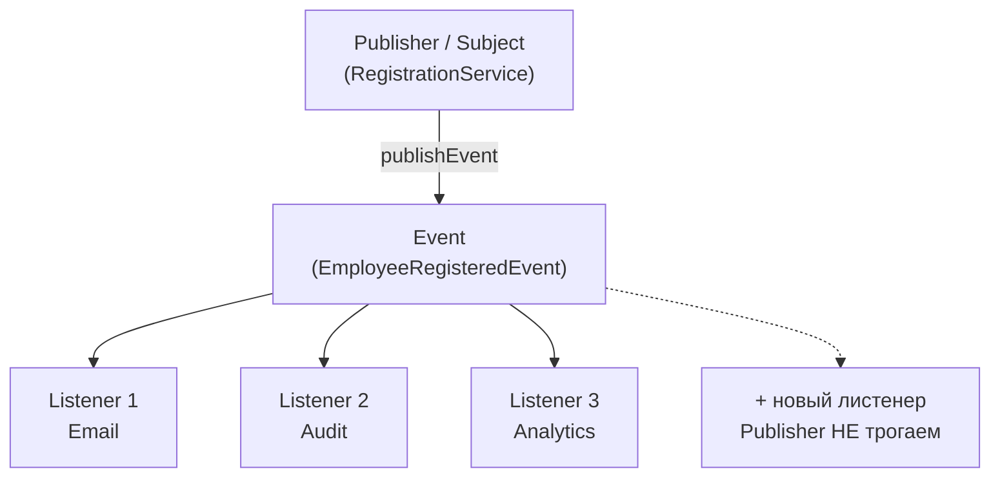

# Золотой урок: паттерн Observer

> Глубокий разбор одного паттерна — от боли, которая его родила, до прод-нюансов Spring (события, фазы транзакций, async). Читай не спеша, код пробуй в IDE. В конце — задачи и самопроверка.

---

## 0. Одна фраза, которую забери сразу

> **Observer — это способ объявить факт и не знать, кто на него отреагирует.** Издатель публикует событие, подписчики реагируют независимо. Их связывает только событие — друг о друге они не знают.

Суть паттерна — **развязка** (decoupling). Тот, кто действует, не должен знать список тех, кто реагирует.

---

## 1. Проблема: god-класс, который дирижирует всеми

Регистрация сотрудника. Со временем к ней «прилипает» всё подряд:

```java
@Service
class RegistrationService {
    private final EmployeeRepository repository;
    private final EmailSender emailSender;
    private final AuditLogger auditLogger;
    private final AnalyticsClient analytics;
    private final SlackNotifier slack;                 // 5 зависимостей

    @Transactional
    public void register(Employee employee) {
        repository.save(employee);

        emailSender.sendWelcome(employee.getEmail());   // всё, что "надо после",
        auditLogger.log("registered: " + employee.getId());   // прибито прямо сюда
        analytics.track("registration", employee.getId());
        slack.post("#hr", "Новый: " + employee.getName());
    }
}
```

Работает. Но болит:

- **OCP ✗** — новая реакция («создай учётку в LDAP») = **правка** работающего `register()`, который ещё и `@Transactional`.
- **SRP ✗** — у сервиса теперь **5 причин меняться**: поменялось письмо / аудит / аналитика / Slack / LDAP. Регистрация должна регистрировать, а не дирижировать HR-департаментом.
- **Тест** — чтобы проверить **одно** сохранение, нужно поднять **5 моков**. Добавили шестую зависимость → старые тесты падают, хотя логика сохранения не менялась.
- **Связанность** — сервис жёстко знает про всех, кого надо позвать.

Корень: сервис **зовёт всех поимённо**. А должен — просто **объявить, что произошло**.

---

## 2. Идея: объяви факт, не зная слушателей

```java
@Service
class RegistrationService {
    private final EmployeeRepository repository;              // ВСЕГО 2 зависимости
    private final ApplicationEventPublisher publisher;

    @Transactional
    public void register(Employee employee) {
        repository.save(employee);
        publisher.publishEvent(new EmployeeRegisteredEvent(employee));   // просто факт
    }
}
```

Всё. Сервис больше **не знает**, кто отреагирует. А реакции — отдельные независимые слушатели:

```java
@Component
class WelcomeEmailListener {
    @EventListener
    void on(EmployeeRegisteredEvent e) { /* отправить письмо */ }
}
@Component
class AuditListener {
    @EventListener
    void on(EmployeeRegisteredEvent e) { /* записать в аудит */ }
}
```

**Что изменилось:**

| | God-класс | Observer |
|---|---|---|
| Зависимостей у сервиса | 5+ | 2 |
| Новая реакция | правка `register()` | новый `@Component` |
| Причин меняться у сервиса | 5 | 1 |
| Моков в тесте сервиса | 5 | 1 (+ проверка публикации) |

> Добавить LDAP = написать `LdapListener` с `@EventListener`. `register()` **не трогаешь ни строчкой** → OCP. У сервиса снова одна ответственность → SRP.

---

## 3. Анатомия



- **Subject / Publisher** — тот, кто порождает событие. Не знает подписчиков.
- **Event** — сообщение о факте. Просто данные.
- **Observer / Listener** — реагирует на событие. Не знает про других слушателей.

**Классическая (не-Spring) форма** — чтобы понимать, что под капотом:

```java
interface Observer { void onEvent(String data); }

class Subject {
    private final List<Observer> observers = new ArrayList<>();
    public void subscribe(Observer o)   { observers.add(o); }
    public void unsubscribe(Observer o) { observers.remove(o); }
    protected void notifyAll(String data) {
        for (Observer o : observers) o.onEvent(data);      // обходит и уведомляет всех
    }
}
```

Spring прячет `List<Observer>` и `subscribe/notify` внутри `ApplicationContext` — ты только публикуешь и слушаешь.

---

## 4. ⭐ Observer в Spring: три кита

### Кит 1 — событие это просто POJO

```java
class EmployeeRegisteredEvent {          // никаких implements! просто данные
    private final Employee employee;
    public EmployeeRegisteredEvent(Employee employee) { this.employee = employee; }
    public Employee getEmployee() { return employee; }
}
```

> ⚠️ **Событие — это письмо, publisher — это почтальон.** Событие ничего не публикует и не реализует `ApplicationEventPublisher`. Если пишешь `class MyEvent implements ApplicationEventPublisher` — ты перепутал роли. (В старом Spring события наследовали `ApplicationEvent`, сейчас — любой POJO.)
>
> Событие делай **immutable** (`final` поля): его получают несколько слушателей, никто не должен его мутировать по пути.

### Кит 2 — рассылка идёт ПО ТИПУ

```java
publisher.publishEvent(new EmployeeRegisteredEvent(employee));   // публикуем ТИП X

@EventListener
void on(EmployeeRegisteredEvent event) { ... }                   // слушаем ТИП X
```

> ⚠️ Spring доставляет событие слушателям **по типу аргумента**. Опубликовал `Employee` вместо `EmployeeRegisteredEvent` — ни один листенер не сработает. **Молча, без ошибки.** Классический баг «ничего не происходит, а исключения нет».

### Кит 3 — фаза и поток это РАЗНЫЕ оси

Самая частая путаница. Две независимые настройки:

| Ось | Аннотация | Отвечает на вопрос |
|---|---|---|
| **Когда** сработать | `@TransactionalEventListener(phase = ...)` | до / после коммита транзакции? |
| **В каком потоке** | `@Async` | синхронно или в отдельном потоке? |

Их **комбинируют** — это не «или-или»:

```java
@TransactionalEventListener(phase = TransactionPhase.AFTER_COMMIT)   // КОГДА: после коммита
@Async                                                                // ГДЕ: в другом потоке
public void on(PaymentCompletedEvent event) { smsSender.send(...); }
```

---

## 5. ⭐ Фазы транзакций — сердце банковского Observer

`@EventListener` **по умолчанию синхронный и внутри той же транзакции**, что и публикация. Это важно.

| Фаза | Когда срабатывает | Особенность |
|---|---|---|
| `BEFORE_COMMIT` | до коммита, ещё в транзакции | исключение → **откат**. Даёт слушателю **право вето** |
| `AFTER_COMMIT` | после успешного коммита | данные точно сохранены. Исключение уже **ничего не откатит** |
| `AFTER_ROLLBACK` | после отката | для реакции на неудачу |
| `AFTER_COMPLETION` | после завершения (любого) | универсальная уборка |

### Почему SMS обязан быть AFTER_COMMIT (главный пример)

```
@EventListener (синхронно, ДО коммита):
   списание → SMS ушло → *транзакция откатывается*
   → денег нет, а клиент получил "Платёж проведён"   ← КАТАСТРОФА

@TransactionalEventListener(AFTER_COMMIT):
   списание → КОММИТ успешен → только теперь SMS
   → уведомление уходит, только если факт реально зафиксирован
```

> **Правило:** необратимые внешние эффекты (SMS, email, вызов чужого API, публикация в Kafka) — **только AFTER_COMMIT.** БД откатить можно, отозвать отправленное во внешний мир — нельзя. Rollback БД и внешний мир **не синхронизированы**, поэтому всё необратимое выносят за коммит.

### Инженерная развилка (обе позиции защитимы)

Фрод-проверка после платежа:
- **`BEFORE_COMMIT` синхронно** → фрод получает **право вето**, подозрительный платёж откатывается. Расплата: внешний вызов **внутри транзакции** держит блокировки и коннекшен — антипаттерн под нагрузкой.
- **`AFTER_COMMIT` + `@Async`** → платёж прошёл, фрод разбирается постфактум (флагует, шлёт алерт). Вето нет.

> Вопрос не «кто прав», а «чего хочет бизнес»: **блокировать** или **мониторить**.

---

## 6. Подводные камни Spring-событий

1. **`@Async` не работает без `@EnableAsync`** в конфиге — метод **тихо** выполнится синхронно. Никакой ошибки, просто не async.
2. **`@Async` без `@TransactionalEventListener`** уходит в другой поток **немедленно**, ещё до коммита → может читать данные, которых в БД ещё нет (или которые откатятся).
3. **Листенер `AFTER_COMMIT`, который упал, ничего не откатывает** — коммит уже прошёл, исключение просто логируется. Для аудита это значит: деньги ушли, записи в аудит нет, и никто не узнал. Иногда аудит намеренно держат `BEFORE_COMMIT`, чтобы он был в одной транзакции с деньгами.
4. **Синхронный листенер, который упал, роняет публикацию.** `@EventListener` по умолчанию синхронный: если он бросит исключение, оно поднимется в вызвавший `publishEvent` код. Не изолировано по умолчанию.
5. **Порядок листенеров** одного события не гарантирован — управляй через `@Order`.
6. **`self-invocation`** — публикация события работает всегда, но `@Async`/`@Transactional` на самом листенере работают через прокси (те же ограничения, что у Spring AOP).

---

## 7. Порядок нескольких слушателей

```java
@Component
class FirstListener {
    @EventListener
    @Order(1)                                   // раньше
    void on(OrderCreatedEvent e) { ... }
}
@Component
class SecondListener {
    @EventListener
    @Order(2)                                   // позже
    void on(OrderCreatedEvent e) { ... }
}
```

По умолчанию порядок **не определён**. Если реакции зависят друг от друга — это запах (лучше сделать их независимыми), но когда нужно — `@Order`.

---

## 8. Observer в дикой природе

**В Spring:**
- вся система событий (`ApplicationEvent`, `@EventListener`);
- встроенные события контекста: `ContextRefreshedEvent`, `ApplicationReadyEvent`;
- `ApplicationListener<T>` — интерфейсная форма слушателя.

**В JDK:**
- `PropertyChangeListener` / `PropertyChangeSupport` (Java Beans);
- (устаревшие `java.util.Observer/Observable` — deprecated с Java 9, не используй);
- слушатели в Swing (`ActionListener` и т.п.).

**В мире:**
- Kafka / RabbitMQ / любые message brokers — Observer в распределённом виде (pub/sub);
- WebSocket-подписки, Server-Sent Events;
- реактивные потоки (`Publisher`/`Subscriber` в Reactor/RxJava) — идейно тот же паттерн.

---

## 9. ⭐ Observer vs двойники

| | Кто с кем связан | Кто работает |
|---|---|---|
| **Observer** | издатель ↔ много подписчиков (broadcast) | **все** подписчики независимо |
| **Chain of Responsibility** | цепочка обработчиков | **один** (нашёл — стоп) |
| **Mediator** | все через центральный посредник | посредник координирует |
| **Pub/Sub (брокер)** | через брокер, издатель не знает даже топик-подписчиков | все подписчики топика |

### Observer vs Chain of Responsibility

> **Observer** — событие получают **все** подписчики, каждый реагирует. **CoR** — запрос идёт до **первого**, кто способен обработать, и там останавливается.

Observer — broadcast (рассылка всем). CoR — поиск обработчика.

### Observer vs Mediator

- **Observer** — однонаправленная рассылка: издатель → подписчики.
- **Mediator** — двунаправленная координация: объекты общаются **через посредника**, чтобы не знать друг о друге напрямую (пример — диспетчер авиатрафика).

### Observer vs Pub/Sub

Идейно одно, разница в связанности:
- **Observer** (классический) — subject **держит список** подписчиков, знает их (пусть и абстрактно).
- **Pub/Sub** — издатель и подписчики развязаны **полностью** через брокер/шину, не знают о существовании друг друга. Spring events — ближе к pub/sub (издатель вообще не держит список).

---

## 10. Когда НЕ надо

- **Реакция одна и всегда обязательна** — прямой вызов проще и понятнее, чем событие в никуда.
- **Нужен результат от реакции** — Observer «выстрелил и забыл», он не возвращает значений издателю. Нужен ответ → обычный вызов метода.
- **Строгий порядок и транзакционная целостность всех шагов** — если все реакции должны быть в одной транзакции и в чёткой последовательности, событийная развязка усложняет (особенно async).
- **Трудно отследить поток** — «магия» событий: по коду не видно, кто отреагирует. На маленькой системе это оверинжиниринг и усложняет отладку.

> Признак здорового Observer: реакции **действительно независимы** и издателю **не нужен их результат**.

---

## 11. Как Observer реализует SOLID

- **OCP** — новая реакция = новый листенер; издатель не трогается.
- **SRP** — издатель только публикует факт; каждая реакция изолирована в своём слушателе.
- **DIP** — издатель зависит от абстракции (механизма событий), а не от конкретных получателей.
- **Loose coupling** — издатель и подписчики не знают друг о друге. Главная ценность.

---

## 12. Частые ошибки

1. **Событие реализует `ApplicationEventPublisher`** — перепутаны роли письма и почтальона.
2. **Публикуется не тот тип** — листенеры молча не срабатывают.
3. **Необратимый эффект (SMS/email) в `@EventListener` до коммита** — уйдёт даже при откате.
4. **`@Async` без `@EnableAsync`** — тихо синхронно.
5. **`@Async` без `AFTER_COMMIT`** — читает незакоммиченные данные.
6. **Мутабельное событие** — один слушатель меняет его, другой получает искажённое.
7. **Логика с результатом через события** — Observer не возвращает ответ издателю.
8. **Зависимость реакций от порядка** без `@Order` — недетерминированное поведение.

---

## 13. Вопросы собеса (с ответами)

**«Что такое Observer и какую проблему решает?»**
> Поведенческий паттерн: издатель объявляет факт (событие), подписчики реагируют независимо, друг о друге не знают. Решает god-класс, который после действия зовёт всех поимённо: новая реакция добавляется новым слушателем, а не правкой издателя (OCP), у издателя одна ответственность (SRP).

**«Как реализован в Spring?»**
> `ApplicationEventPublisher.publishEvent(event)` + `@EventListener` на методе слушателя. Событие — обычный POJO, рассылка по типу аргумента.

**«Чем `@EventListener` отличается от `@TransactionalEventListener`?»**
> Первый срабатывает при публикации (по умолчанию синхронно, в той же транзакции). Второй привязан к фазе транзакции — например `AFTER_COMMIT`, гарантируя, что реакция случится только после успешного коммита.

**«Почему уведомление слать после коммита?»**
> SMS/email необратимы. Если отправить до коммита, а транзакция откатится — клиент получит уведомление о том, чего не произошло. БД откатывается, отправленное во внешний мир — нет.

**«Разница между `@Async` и `AFTER_COMMIT`?»**
> Разные оси. `AFTER_COMMIT` — *когда* (после коммита). `@Async` — *в каком потоке* (отдельном). Комбинируются.

**«Observer vs Chain of Responsibility?»**
> В Observer работают все подписчики (broadcast). В CoR запрос идёт до первого способного обработать и останавливается.

**«Минусы Observer?»**
> Трудно отследить поток (не видно по коду, кто отреагирует); «выстрелил и забыл» — нет ответа издателю; при async легко словить проблемы с транзакциями и порядком.

---

## 14. Задачи (по нарастанию, делай в IDE)

**Уровень 1.** `OrderService.placeOrder()` публикует `OrderPlacedEvent`. Два `@EventListener`: `InventoryListener` (списать со склада), `EmailListener` (письмо клиенту). Проверь, что оба срабатывают.

**Уровень 2 — фазы.** Сделай `placeOrder()` `@Transactional`. `EmailListener` переведи на `@TransactionalEventListener(AFTER_COMMIT)`. Смоделируй исключение после публикации (откат) и убедись, что письмо **не** ушло.

**Уровень 3 — async + порядок.** Добавь `@Async` к email-листенеру (не забудь `@EnableAsync`). Добавь третий листенер `AnalyticsListener`, задай порядок через `@Order`.

**Уровень 4 — развилка.** `PaymentService` публикует `PaymentCompletedEvent`. `SmsListener` (`AFTER_COMMIT` + `@Async`) и `FraudListener`. Реши и **обоснуй**: фрод — `BEFORE_COMMIT` синхронно (вето) или `AFTER_COMMIT` async (мониторинг)?

**Уровень 5 — рефактор.** Возьми свой продовый god-метод, который после действия зовёт 3-4 сервиса, и развяжи через события. Сравни число зависимостей и лёгкость теста до/после.

---

## 15. Проверь себя (закрой файл, ответь вслух)

1. Какую боль лечит Observer и какие принципы реализует?
2. Три кита Spring-событий (POJO / по типу / фаза≠поток).
3. Почему событие не должно ничего реализовывать?
4. Что произойдёт, если опубликовать не тот тип события?
5. Почему SMS = `AFTER_COMMIT`, а не `@EventListener` до коммита?
6. `@Async` vs `AFTER_COMMIT` — разные оси, можно ли вместе?
7. Что будет с `@Async`, если забыть `@EnableAsync`?
8. Observer vs Chain of Responsibility — кто работает?
9. Observer vs Mediator — направление связи?
10. Когда Observer — плохая идея?

> Ответил на все десять своими словами — Observer у тебя понят, а не выучен.
