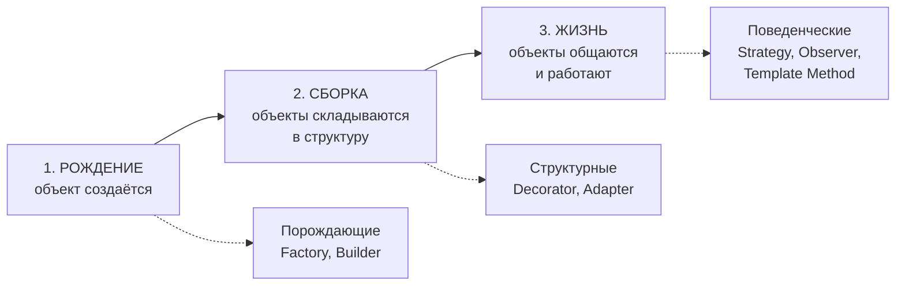
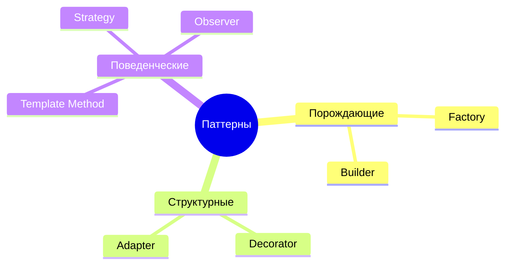
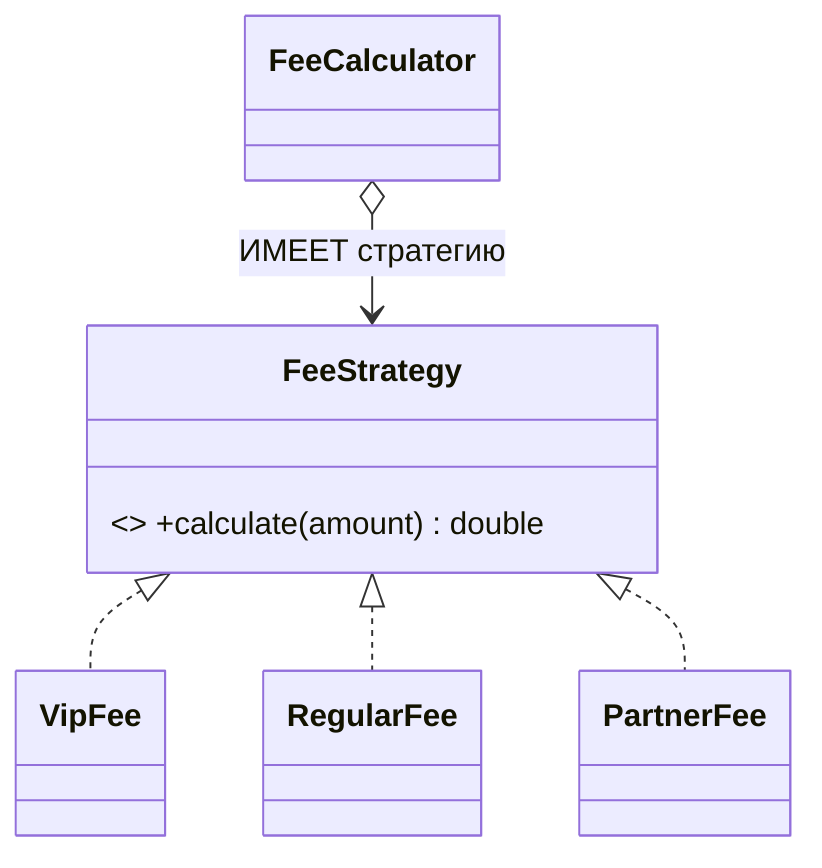
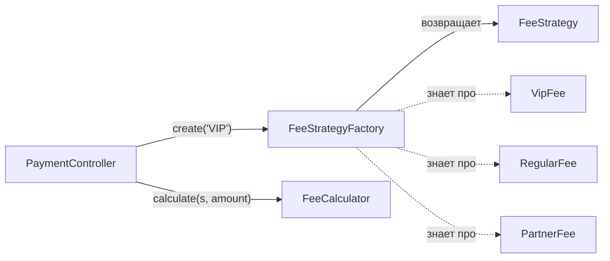
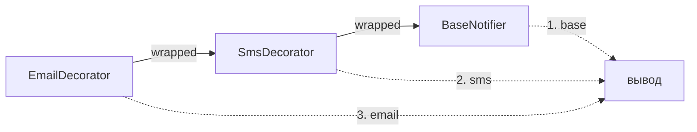
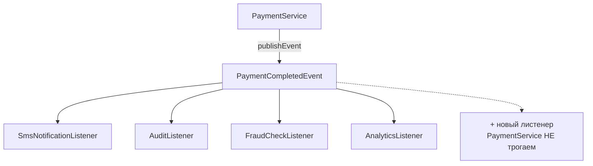
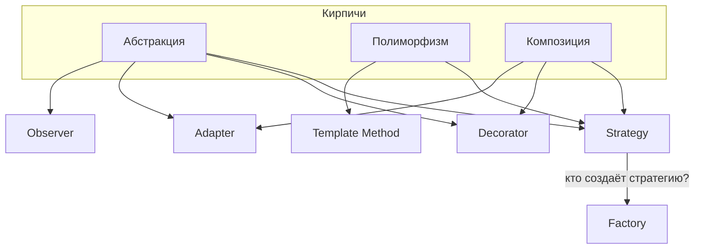

# Паттерны проектирования — конспект для закрепления

> **Главная мысль всего файла:** паттерн — это **не заклинание, а имя для комбинации принципов SOLID**. Strategy = OCP + DIP + композиция. Decorator = OCP + композиция вместо наследования. Ты не учишь новое — ты называешь то, что уже понимаешь.

> **Как пользоваться:** один паттерн в день. Прочитал → **закрыл файл** → ответил на «Проверь себя» своими словами. Схемы рендерятся на GitHub нативно.

---

## Почему паттернов ровно три типа

Деление придумали не ради красоты каталога. Классификация из книги «банды четырёх» (GoF, 1994) отвечает на вопрос: **в какой момент жизни объектов паттерн вмешивается?**

У любого объекта в системе три этапа:



Отсюда и три типа — по одному на этап.

### 1. Порождающие (Creational) — про **создание**

**Вопрос, на который отвечают:** «как создать объект, не прибивая клиента к конкретному классу?»

**Почему так назвали:** от «породить», create — они управляют **рождением** объектов.

**Суть:** обычный `new ConcreteClass()` — это жёсткая связь. Клиент, который пишет `new`, **знает конкретный класс**, а значит зависит от него (DIP ✗) и при появлении нового типа требует правки (OCP ✗). Порождающие паттерны **изымают `new` из клиента** и прячут его в отдельное место.

- **Factory** — «кто-то другой решит, какой класс создать»;
- **Builder** — «объект слишком сложный, соберу его пошагово».

> Общий смысл: **отделить *что* создаётся от *как* создаётся.**

### 2. Структурные (Structural) — про **композицию**

**Вопрос:** «как сложить объекты в большую структуру, не наплодив классов и не сломав гибкость?»

**Почему так назвали:** они определяют **структуру** — кто кого держит, кто в кого вложен.

**Суть:** наивный ответ на «нужно скомбинировать поведение» — наследование. Но оно даёт class explosion и жёсткость. Структурные паттерны отвечают: **оборачивай объекты друг в друга** вместо того, чтобы наследовать. Это буквально прикладной «composition over inheritance».

- **Decorator** — обернуть и **добавить** поведение (интерфейс сохраняется);
- **Adapter** — обернуть и **перевести** интерфейс (интерфейс меняется).

> Общий смысл: **сложные структуры собираются обёртыванием, а не иерархией наследования.**

### 3. Поведенческие (Behavioral) — про **взаимодействие**

**Вопрос:** «как объекты распределяют обязанности и общаются между собой?»

**Почему так назвали:** они про **поведение** — кто что делает и кто кого зовёт.

**Суть:** самая частая болезнь работающей системы — один класс знает слишком много: сам решает *как* считать (`if/else`), сам зовёт всех поимённо, сам дирижирует. Поведенческие паттерны **распределяют обязанности** и **развязывают** участников.

- **Strategy** — «алгоритм — отдельный объект, я его не знаю»;
- **Template Method** — «скелет мой, шаги твои»;
- **Observer** — «я объявляю факт, кто отреагирует — не моё дело».

> Общий смысл: **вынести решение/реакцию туда, где ей место, и развязать участников.**

### Как этим пользоваться на практике

Классификация — это **навигация по проблеме**. Наткнулся на боль → спроси, на каком этапе она:

| Твоя боль звучит как… | Смотри в тип |
|---|---|
| «клиент делает `new` и знает все классы» / «конструктор — каша» | **Порождающие** |
| «плодятся классы на комбинации» / «чужой интерфейс не стыкуется» | **Структурные** |
| «`if/else` по типу» / «класс дирижирует всеми» / «дублируется скелет» | **Поведенческие** |

> **Важная оговорка:** границы не абсолютны. Factory часто создаёт стратегии (порождающий обслуживает поведенческий), Decorator и Adapter оба оборачивают, но решают разные задачи. Классификация — **подсказка, а не закон**. На собесе от тебя ждут, что ты назовёшь тип и объяснишь **почему** — само деление на три группы это уже показывает понимание.

**Проверь себя:**
1. Какой вопрос задаёт каждый из трёх типов?
2. Почему Decorator — структурный, а Strategy — поведенческий, если оба про «гибкое поведение»?
3. У тебя в коде `new` разбросан по контроллерам — в какой тип паттернов смотреть?

---

## Карта: 7 паттернов, которые реально спрашивают

| Паттерн | Тип | Лечит боль | Ключевые принципы |
|---|---|---|---|
| **Strategy** | поведенческий | `if/else` по типу в расчёте | OCP + DIP + композиция |
| **Template Method** | поведенческий | дублирование скелета алгоритма | OCP + наследование |
| **Factory** | порождающий | `new`/`if` по типу у клиента | SRP + OCP + DIP |
| **Builder** | порождающий | телескоп конструкторов | SRP + читаемость |
| **Decorator** | структурный | комбинаторный взрыв классов | OCP + композиция |
| **Adapter** | структурный | несовместимые интерфейсы | OCP + DIP + изоляция |
| **Observer** | поведенческий | god-класс, дирижирующий всеми | SRP + OCP + развязка |



---

## 1. Strategy

**Определение:** семейство взаимозаменяемых алгоритмов, каждый в своём классе за общим интерфейсом. Клиент получает стратегию **снаружи** и делегирует ей.

**Боль до:**
```java
double calculate(String clientType, double amount) {
    if (clientType.equals("VIP"))     return 0;
    else if (clientType.equals("REGULAR")) return amount * 0.02;
    else if (clientType.equals("PARTNER")) return amount * 0.01 + 5;
    // новый тип → правим ЭТОТ метод (OCP ✗), все формулы свалены (SRP ✗)
}
```

**После:**
```java
interface FeeStrategy { double calculate(double amount); }

class VipFee     implements FeeStrategy { public double calculate(double a) { return 0; } }
class RegularFee implements FeeStrategy { public double calculate(double a) { return a * 0.02; } }
class PartnerFee implements FeeStrategy { public double calculate(double a) { return a * 0.01 + 5; } }

class FeeCalculator {
    public double calculate(FeeStrategy strategy, double amount) {
        return strategy.calculate(amount);   // просто делегирует, НИКАКИХ if
    }
}
```



**Ключевое прозрение:** калькулятор **не выбирает** стратегию — он получает её готовой. Выбор — не его забота (этим займётся Factory).

**Spring-way:** стратегии stateless → синглтон-бины. Контейнер сам соберёт `Map<String, FeeStrategy>` или `List<FeeStrategy>`.

**Проверь себя:**
1. Какой запах в коде говорит «сюда просится Strategy»?
2. Почему `FeeCalculator` не должен сам выбирать стратегию?
3. Чем Strategy отличается от Template Method?

---

## 2. Template Method

**Определение:** базовый класс задаёт **скелет** алгоритма (`final`), а варьируемые шаги отдаёт наследникам (`protected abstract`).

```java
public abstract class AbstractPaymentProcessor {
    public final void process(PaymentRequest req) {   // final — скелет ЗАПЕРТ
        validate(req);                                 // общий, private
        charge(req);                                   // ← ВАРЬИРУЕТСЯ
        sendNotification(req);                         // общий, private
    }
    private void validate(PaymentRequest req) { /* guard */ }
    protected abstract void charge(PaymentRequest req);   // точка расширения
    private void sendNotification(PaymentRequest req) { /* общее */ }
}
```

**Формула:** `final` + `protected abstract` = **защита инварианта при контролируемой вариативности**.

**Что защищает `final`:** ни один наследник не может переопределить `process` и **пропустить** guard или уведомление. Наследнику оставлена ровно одна точка влияния — `charge`. Это **Hollywood Principle**: «не ты зовёшь фреймворк — фреймворк зовёт тебя».

**Главное — правильно мапить:** что **одинаково** → в базу (заперто); что **отличается** → `abstract`.

**Strategy vs Template Method — братья:**

| | Template Method | Strategy |
|---|---|---|
| Механизм | **наследование** (`protected abstract`) | **композиция** (отдельный объект) |
| Варьируется | **шаг** внутри алгоритма | **весь алгоритм** |
| Смена в рантайме | нет (тип фиксирован) | да (подменил объект) |

**Проверь себя:**
1. Почему скелет — `final`, а общие шаги — `private`?
2. Как понять, какой шаг делать `abstract`?

---

## 3. Factory

**Определение:** изолирует **создание объектов** в одном месте. Клиент не знает про конкретные классы и не пачкается `new`/`if-по-типу`.

**Боль до** — Strategy убрал `if` из расчёта, но выбор всплыл в контроллере:
```java
class PaymentController {
    double handle(String clientType, double amount) {
        FeeStrategy strategy;
        if (clientType.equals("VIP")) strategy = new VipFee();
        else if (...) ...        // контроллер ЗНАЕТ про все типы (SRP ✗)
    }
}
```

**После** — `if/else` не исчез из вселенной, а **сконцентрировался в одном месте**:
```java
class FeeStrategyFactory {
    private static final Map<String, FeeStrategy> MAP = Map.of(
        "VIP",     new VipFee(),
        "REGULAR", new RegularFee(),
        "PARTNER", new PartnerFee()
    );
    public FeeStrategy create(String clientType) {
        FeeStrategy s = MAP.get(clientType);
        if (s == null) throw new IllegalArgumentException("Unknown type: " + clientType);
        return s;   // ← null-guard обязателен, иначе NPE всплывёт далеко от причины
    }
}
```



**Ловушки:**
- `map.get()` вернёт `null` на неизвестном типе → NPE **позже**, вдали от причины. Бросай явное исключение.
- `public static Map` — открытое мутабельное состояние, любой снаружи сделает `.clear()`. Только `private static final`.

**Strategy + Factory = напарники:** Strategy определяет *взаимозаменяемые алгоритмы*, Factory *решает, какой создать*.

**Проверь себя:**
1. Почему Factory не «прячет» проблему, если `if/else` всё равно внутри неё?
2. Что плохого в `map.get()` без проверки на null?

---

## 4. Builder

**Определение:** пошаговая сборка сложного объекта через именованные цепочечные методы + финальный `build()`.

**Три боли, которые лечит:**
1. **Нечитаемость:** `new Employee("Yeset", "y@bank.kz", null, "IT", null, true)` — что значит `true`?
2. **Telescoping constructors:** комбинаторный взрыв конструкторов под каждый набор опциональных полей.
3. **Путаница позиций:** `email` и `phone` оба `String` — перепутал местами, компилятор **молчит**.

```java
class Employee {
    private final String name, email, phone, department, position;
    private final boolean remote;

    private Employee(Builder b) {           // приватный конструктор
        this.name = b.name; this.email = b.email; this.phone = b.phone;
        this.department = b.department; this.position = b.position; this.remote = b.remote;
    }

    static class Builder {
        private final String name, email;                // ОБЯЗАТЕЛЬНЫЕ → в конструктор
        private String phone, department, position;      // опциональные
        private boolean remote;

        Builder(String name, String email) { this.name = name; this.email = email; }

        Builder phone(String phone)        { this.phone = phone; return this; }       // return this → цепочка
        Builder department(String dep)     { this.department = dep; return this; }
        Builder position(String position)  { this.position = position; return this; }
        Builder remote(boolean remote)     { this.remote = remote; return this; }

        Employee build() { return new Employee(this); }
    }
}
```

**Использование — читается как предложение:**
```java
Employee e = new Employee.Builder("Yeset", "y@bank.kz")
        .position("Java Dev")
        .remote(true)
        .build();                    // phone, department просто пропустили
```

**Три опоры:** обязательные → в конструктор Builder · опциональные → методы с `return this` · `build()` собирает **immutable** объект.

**В твоём мире:** `StringBuilder`, `Stream.builder()`, `UriComponentsBuilder`, Lombok `@Builder`.

**Проверь себя:**
1. Что даёт `return this` в каждом методе?
2. Почему обязательные поля идут в конструктор Builder, а не отдельными методами?

---

## 5. Decorator

**Определение:** обернуть объект в другой **с тем же интерфейсом**, добавив поведение — вместо того чтобы плодить наследников на каждую комбинацию.

**Боль до — class explosion:**
```java
class EmailNotifier extends Notifier { }
class EmailSmsNotifier extends Notifier { }
class EmailSmsSlackNotifier extends Notifier { }
class SmsSlackNotifier extends Notifier { }
// 3 канала → 7 комбинаций. 4 канала → 15. OCP ✗
```

**После — матрёшка. 4 канала = 4 декоратора, любые комбинации в рантайме:**
```java
interface Notifier { void send(String msg); }

class BaseNotifier implements Notifier {              // ← ЯДРО матрёшки (обязательно!)
    public void send(String msg) { System.out.println("base: " + msg); }
}

abstract class NotifierDecorator implements Notifier {
    protected final Notifier wrapped;                 // ← КОМПОЗИЦИЯ: держит того, кого оборачивает
    protected NotifierDecorator(Notifier wrapped) { this.wrapped = wrapped; }
}

class EmailDecorator extends NotifierDecorator {
    public EmailDecorator(Notifier wrapped) { super(wrapped); }
    public void send(String msg) {
        wrapped.send(msg);                            // 1. пусть внутренний отработает
        System.out.println("email: " + msg);          // 2. добавляем СВОЁ
    }
}
```



**Порядок выполнения** для `new EmailDecorator(new SmsDecorator(new BaseNotifier()))`:
> **base → sms → email**. Вызовы **ныряют вглубь** до ядра, а печать разворачивается **изнутри наружу** (разворот стека).
>
> Нюанс: порядок зависит от того, что стоит **до**, а что **после** `wrapped.send()`. Поставь `wrapped.send()` последним — порядок перевернётся.

**Три опоры:** реализует тот же интерфейс (снаружи неотличим) · держит объект внутри (композиция) · делегирует + добавляет своё.

### Decorator в Spring (прод-нюанс!)

Когда декоратор становится **бином**, появляется проблема двух бинов одного интерфейса:

```java
@Service
@Qualifier("stripe")                                   // помечаем ЯДРО именем
class StripePaymentGateway implements PaymentGateway { ... }

@Service
@Primary                                               // ← «когда просят PaymentGateway — по умолчанию Я»
class LoggingPaymentGateway implements PaymentGateway {
    private final PaymentGateway wrapped;

    // @Qualifier на ПАРАМЕТРЕ КОНСТРУКТОРА — иначе Spring вложит @Primary-бин, т.е. САМ СЕБЯ → рекурсия
    public LoggingPaymentGateway(@Qualifier("stripe") PaymentGateway wrapped) {
        this.wrapped = wrapped;
    }
    @Override public PaymentResult pay(PaymentRequest req) {
        long start = System.currentTimeMillis();
        PaymentResult result = wrapped.pay(req);
        System.out.printf("Платёж занял %d ms%n", System.currentTimeMillis() - start);
        return result;
    }
}

@RestController
class PaymentController {
    private final PaymentGateway gateway;              // просит ГОЛЫЙ интерфейс
    public PaymentController(PaymentGateway gateway) { // → получит @Primary (логирующий)
        this.gateway = gateway;                        // и НЕ ЗНАЕТ про логирование
    }
}
```

> **Формула декоратора-бина:** обёртка → `@Primary`. Ядро → `@Qualifier("name")`. Внутрь обёртки ядро вкладывается **через конструктор** с `@Qualifier` на параметре.
>
> ⚠️ **`@Qualifier` на голом поле без `@Autowired`/конструктора — мёртвая аннотация.** Она *уточняет* инъекцию, но не *создаёт* её.

**В JDK:** `new BufferedReader(new InputStreamReader(...))` — это буквально Decorator. `Collections.unmodifiableList(...)`.

**Проверь себя:**
1. Почему без `BaseNotifier` матрёшка не запускается?
2. Почему обёртка `@Primary`, а ядро `@Qualifier`? Что будет без `@Qualifier` в конструкторе?
3. Как изменить порядок вывода слоёв?

---

## 6. Adapter

**Определение:** класс реализует **твой** интерфейс, держит **чужой** внутри, и в методе **переводит** формат одного в формат другого.

**Аналогия:** переходник для розетки. Не меняешь вилку ноутбука (своё), не переделываешь розетку в отеле (чужое) — ставишь **прокладку** между ними.

```java
interface CitizenVerifier {                       // ТВОЙ интерфейс
    VerificationResult verify(Citizen citizen);
}

class GovTechClient {                             // ЧУЖОЙ SDK (менять нельзя)
    GovResponse checkPerson(String iin, String birthDateFormatted) { ... }
}

class GovTechVerifierAdapter implements CitizenVerifier {
    private static final DateTimeFormatter FMT = DateTimeFormatter.ofPattern("dd.MM.yyyy");
    private final GovTechClient client;           // держит чужой SDK ПОЛЕМ через конструктор

    public GovTechVerifierAdapter(GovTechClient client) { this.client = client; }

    @Override
    public VerificationResult verify(Citizen citizen) {
        // ПЕРЕВОД ВХОДА: твой формат → формат SDK
        GovResponse response = client.checkPerson(
            citizen.getIin(),
            citizen.getBirthDate().format(FMT)    // LocalDate → "01.02.1999"
        );
        // ПЕРЕВОД ВЫХОДА: чужой ответ → твой домен
        return new VerificationResult(response.statusCode == 0, response.errorMessage);
    }
}
```


> ⚠️ **Adapter переводит В ОБЕ СТОРОНЫ:** запрос → чужой формат, чужой ответ → твой домен. Типичная ошибка — сделать одну сторону и забыть вторую.

### Anti-corruption layer (термин из DDD — можно щегольнуть на собесе)

Адаптер — это **карантин**. Чужие типы (`GovResponse`, магический `statusCode == 0`, `"Y"/"N"` вместо boolean) **не пересекают его границу**:

1. **DIP** — система зависит от твоей абстракции, не от чужой библиотеки.
2. **OCP** — смена провайдера = новый адаптер, бизнес-код не трогается.
3. **Чужая кривизна не заражает домен** — грязь заперта в одной точке.
4. **Тестируемость** — мокаешь свой интерфейс, а не чужой SDK.

> ⚠️ Дырка в карантине: если контроллер зависит от `GovTechVerifierAdapter` (конкретики), а не от `CitizenVerifier` — наружу утекло **знание о провайдере**. Смысл потерян.

### Переключение провайдера через конфиг (Spring)

```java
@Component
@ConditionalOnProperty(name = "sms.provider", havingValue = "twilio")
class TwilioSmsAdapter implements SmsSender { ... }

@Component
@ConditionalOnProperty(name = "sms.provider", havingValue = "kz")
class KzSmsAdapter implements SmsSender { ... }
```
В `application.yml`: `sms.provider: kz` → Spring поднимет нужный бин. Бизнес-код не меняется **ни строчкой**.

**Decorator vs Adapter — не путать:**

| | Adapter | Decorator |
|---|---|---|
| Цель | **совместимость** | **новое поведение** |
| Интерфейс | **меняет** (чужой → твой) | **сохраняет** (тот же) |
| Ответ на вопрос | «как состыковать?» | «как добавить, не наследуя?» |

**Проверь себя:**
1. Обе стороны перевода — какие именно?
2. Что такое anti-corruption layer и зачем он?
3. Чем Adapter отличается от Decorator?

---

## 7. Observer (publish–subscribe)

**Определение:** издатель **объявляет факт** и не знает, кто на него отреагирует. Подписчики реагируют независимо. Связывает их только **событие**.

**Боль до — god-класс:**
```java
@Transactional
public void processPayment(PaymentRequest request) {
    repository.charge(...);
    smsSender.send(...);          // 5 зависимостей в конструкторе
    auditLogger.log(...);         // новая реакция → правим ЭТОТ метод (OCP ✗)
    analytics.track(...);         // 5 причин меняться (SRP ✗)
    fraudDetector.check(...);     // тест: 5 моков ради одной строчки
}
```

**После — сервис знает только своё дело:**
```java
@Service
class PaymentService {
    private final PaymentRepository repository;            // ВСЕГО 2 зависимости
    private final ApplicationEventPublisher publisher;

    @Transactional
    public void processPayment(PaymentRequest request) {
        repository.charge(request.getClientId(), request.getAmount());
        publisher.publishEvent(new PaymentCompletedEvent(request));   // просто объявил факт
    }
}

class PaymentCompletedEvent {                    // событие = ПРОСТОЙ POJO, ничего не реализует!
    private final PaymentRequest request;
    public PaymentCompletedEvent(PaymentRequest request) { this.request = request; }
    public PaymentRequest getRequest() { return request; }
}

@Component
class SmsNotificationListener {
    private final SmsSender smsSender;
    SmsNotificationListener(SmsSender smsSender) { this.smsSender = smsSender; }

    @TransactionalEventListener(phase = TransactionPhase.AFTER_COMMIT)
    @Async
    public void on(PaymentCompletedEvent event) { smsSender.send(...); }
}
```



> ⚠️ **Событие — это данные (письмо). Publisher — это Spring (почтальон).** Событие ничего не реализует. Если пишешь `class MyEvent implements ApplicationEventPublisher` — роли перепутаны.
>
> ⚠️ Spring рассылает **по типу**. Публикуешь `PaymentRequest`, а листенер ждёт `PaymentCompletedEvent` → **ни один листенер не вызовется. Молча, без ошибки.**

### Фаза и поток — РАЗНЫЕ оси (частая путаница)

| Ось | Аннотация | Отвечает на вопрос |
|---|---|---|
| **Когда** | `@TransactionalEventListener(phase = ...)` | до/после коммита? |
| **В каком потоке** | `@Async` | синхронно/асинхронно? |

Их **комбинируют**: `@TransactionalEventListener(AFTER_COMMIT)` + `@Async`.

**Фазы:**
- **`BEFORE_COMMIT`** — внутри транзакции. Исключение → **откат**. Даёт листенеру **право вето**.
- **`AFTER_COMMIT`** — после коммита. Данные точно сохранены. Исключение **ничего не откатит** (коммит уже прошёл).

**Почему SMS обязан быть AFTER_COMMIT:**
> SMS — **необратимый побочный эффект во внешнем мире**. Транзакция откатится → деньги на месте, а клиент уже получил «Платёж проведён». Откатить БД можно, **отозвать SMS — нет**.

**Инженерная развилка по фроду** (обе позиции защитимы — вопрос к бизнесу):
- **`BEFORE_COMMIT` синхронно** → фрод получает **право вето**, подозрительный платёж откатывается. Расплата: внешний вызов **внутри транзакции** держит блокировки и коннекшен — известный антипаттерн под нагрузкой.
- **`AFTER_COMMIT` + `@Async`** → платёж прошёл, фрод разбирается постфактум (флагует, шлёт алерт). Вето нет.

**Подводные камни:**
- `@Async` работает только при `@EnableAsync` в конфиге — иначе **тихо** выполнится синхронно.
- `@Async` **без** `@TransactionalEventListener` уходит в другой поток **до коммита** → может читать данные, которых ещё нет.
- Листенер `AFTER_COMMIT`, который упал, ничего не откатит — исключение просто залогируется. Для аудита в банке: деньги ушли, записи нет, никто не узнал. Иногда аудит намеренно держат `BEFORE_COMMIT`.
- Событие должно быть **immutable** (`final` поля): его получают несколько листенеров, никто не должен мутировать по пути.

**Observer vs Decorator vs Chain of Responsibility:**

| | Кто работает | Цель |
|---|---|---|
| **Decorator** | **ВСЕ** слои, накапливают | добавить поведение |
| **Chain of Responsibility** | **ОДИН** (нашёл обработчика → стоп) | найти обработчика |
| **Observer** | **все подписчики**, независимо | развязать издателя и реакции |

> Метафора: **Decorator** — одеться (майка + рубашка + куртка, все греют). **CoR** — эскалация в поддержке (оператор → старший → менеджер, останавливается на решившем). **Spring Security filter chain** — это CoR.

**Проверь себя:**
1. Почему событие не должно ничего реализовывать?
2. Чем `@Async` отличается от `AFTER_COMMIT`? Можно ли оба сразу?
3. Почему SMS нельзя слать до коммита?
4. Что произойдёт, если опубликовать не тот тип события?

---

## Как паттерны сцеплены



- **Strategy → Factory:** Strategy убрал `if` из расчёта, Factory — из выбора. Напарники.
- **Strategy ↔ Template Method:** одна задача (спрятать варьируемое), два ответа — композиция vs наследование.
- **Decorator ↔ Adapter:** оба оборачивают. Decorator **сохраняет** интерфейс и добавляет; Adapter **меняет** интерфейс и переводит.
- **Observer:** развязка через событие — предельная форма «клиент не знает исполнителя».

Одни и те же кирпичи: **абстракция, полиморфизм, композиция.**

---

## Финальный самотест

1. Почему паттерны делятся именно на три типа? Какой этап жизни объектов за каждым?
2. Назови боль, которую лечит каждый из 7 паттернов — одной фразой.
3. Strategy vs Template Method — в чём разница механизма?
4. Decorator vs Adapter — что меняется, что сохраняется?
5. Decorator vs Chain of Responsibility — кто работает?
6. Формула декоратора-бина в Spring: какая аннотация где и почему?
7. Фаза vs поток в Observer — какие аннотации, можно ли комбинировать?
8. Почему SMS = AFTER_COMMIT, а не BEFORE_COMMIT?
9. Что такое anti-corruption layer?
10. Какие три кирпича лежат под всеми паттернами?

> Отвечаешь на все десять своими словами — паттерны у тебя в руках на уровне понимания, а не зубрёжки.

---

## Что дальше

**Единственный оставшийся барьер — набить руки в IDE.** Все эти паттерны ты понимаешь на уровне принципов, но на лайвкодинге спросят не «что такое Strategy», а «напиши». Возьми 2–3 задачи отсюда и доведи до **зелёной компиляции** в IntelliJ — это даст больше, чем ещё одно прочтение.

**Типичные механические промахи** (лови сам):
- `public` на реализации метода интерфейса (нельзя сузить видимость → ошибка компиляции);
- `abstract` на методе без тела;
- имя конструктора = имя класса;
- `@Override` — ставь всегда, он ловит несовпадение сигнатуры;
- `final`-поле обязано быть инициализировано (конструктор, не голое `@Autowired`);
- вчитывайся в **смысл параметров** чужого API (`to` vs `from`, `currencyCode` vs единица);
- приоритет операций: `(long) (amount * 100)`, а не `(long) amount * 100`.
