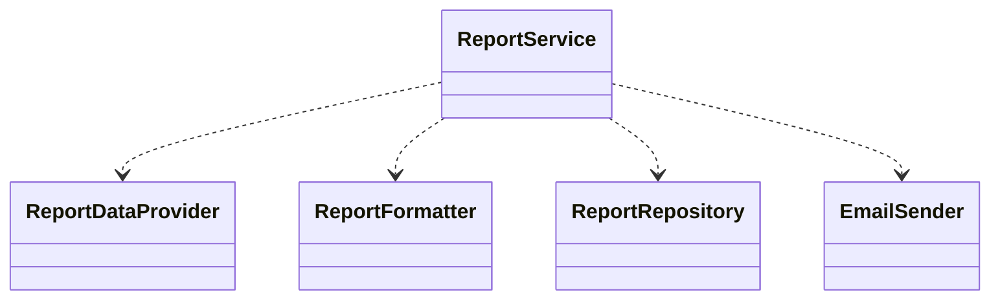
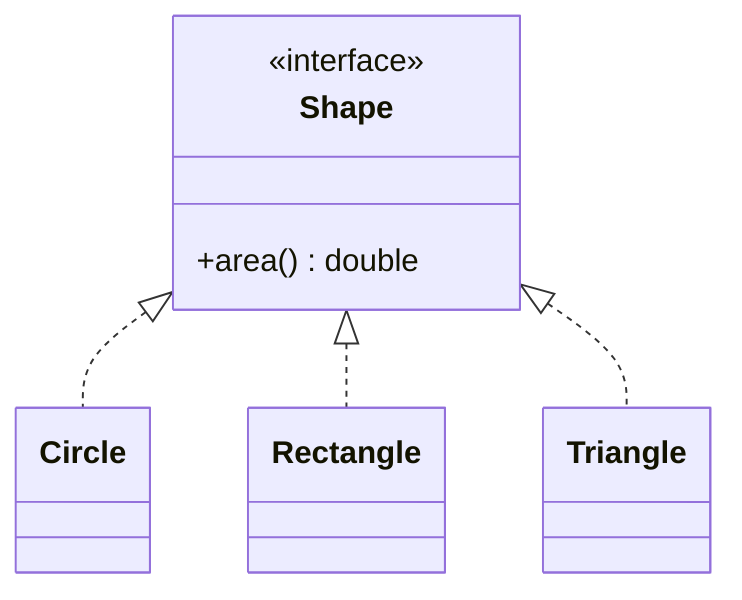
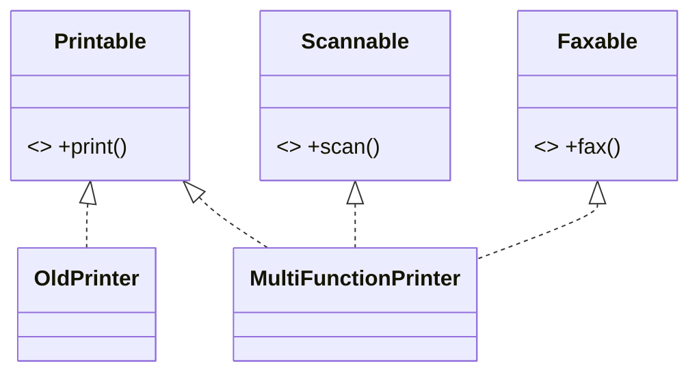
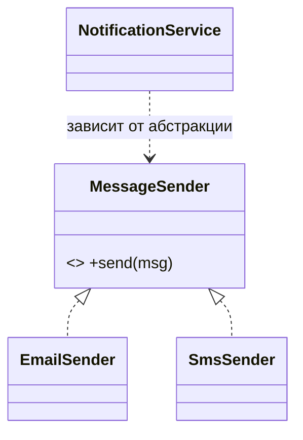
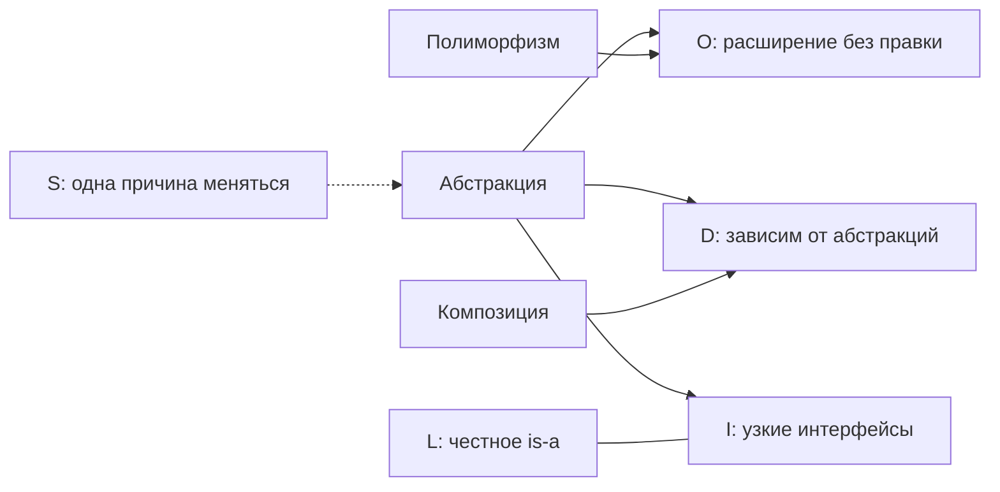

# SOLID — кратко, с примерами и схемами

Пять принципов ООП-дизайна. Под каждым: определение, запах нарушения, пример «до → после».

| Буква | Принцип | Суть в одной строке |
|-------|---------|---------------------|
| **S** | Single Responsibility | Один класс — одна причина для изменения |
| **O** | Open/Closed | Открыт для расширения, закрыт для изменения |
| **L** | Liskov Substitution | Наследник подставляется вместо родителя, не ломая поведение |
| **I** | Interface Segregation | Узкие интерфейсы лучше одного «жирного» |
| **D** | Dependency Inversion | Завись от абстракций, а не от конкретики |

> **Главная мысль:** SOLID — это не пять отдельных правил, а одна сетка вокруг идеи «завись от узких абстракций и расширяйся полиморфизмом, а не правкой старого кода». Все они держатся на трёх кирпичах: **абстракция, полиморфизм, композиция.**

---

## S — Single Responsibility Principle

**Определение:** у класса должна быть только одна **причина для изменения** — то есть один «заказчик», который мог бы потребовать правок.

**Запах нарушения:** класс делает несколько несвязанных вещей; в его описании есть «и»; ты лезешь в него по разным поводам; смешаны слои (бизнес-логика + БД + форматирование).

**До** — «god class», который меняется по четырём причинам:

```java
class Report {
    void generate()              { /* собрать данные */ }
    String formatAsHtml()        { /* формат */ }
    void saveToFile(String path) { /* хранение */ }
    void sendByEmail(String to)  { /* доставка */ }
}
```

**После** — сущность отдельно, концерны отдельно, оркестрация отдельно:

```java
class Report { /* только данные */ }
class ReportDataProvider { Report fetch(); }
class ReportFormatter    { String formatAsHtml(Report r); }
class ReportRepository   { void save(String content, String path); }
class EmailSender        { void send(String to, String content); }
class ReportService      { /* оркестрирует остальных через DI */ }
```



**Ловушка:** вынести helpers — мало. Если вся координация осталась в одном методе сущности, «бог» всё ещё жив. Сущность ≠ оркестратор.

---

## O — Open/Closed Principle

**Определение:** новое поведение добавляется **новым кодом**, а не правкой старого, протестированного.

**Запах нарушения:** цепочки `if/else` или `switch` по типу; `instanceof`, растущие с каждой новой фичей; правишь один и тот же метод при каждом добавлении.

**До** — каждая новая фигура заставляет менять `area()`:

```java
double area(Object shape) {
    if (shape instanceof Circle)    { /* ... */ }
    else if (shape instanceof Rect) { /* ... */ }
    // новая фигура → снова правим этот метод
}
```

**После** — каждая фигура считает себя сама; добавление новой не трогает существующий код:

```java
interface Shape { double area(); }
class Circle    implements Shape { public double area() { /* ... */ } }
class Rectangle implements Shape { public double area() { /* ... */ } }
class Triangle  implements Shape { public double area() { /* ... */ } } // просто дописали класс
```



**Достигается:** полиморфизмом. Убери `switch` по типу → вынеси поведение в полиморфный метод за абстракцией.

---

## L — Liskov Substitution Principle

**Определение:** везде, где ожидается родитель, можно подставить любого наследника — и всё продолжит работать **правильно**. Это про **поведение**, а не про компиляцию.

**Запах нарушения:** override бросает `UnsupportedOperationException` или делает пусто; наследник усиливает предусловия; в клиентском коде появляется `if (obj instanceof КонкретныйНаследник)`.

**Классика — `Square extends Rectangle`:**

```java
void resizeAndCheck(Rectangle r) {
    r.setWidth(5);
    r.setHeight(4);
    System.out.println(r.area());
    // Rectangle → 20 (ожидаемо)
    // Square    → 16 (сеттер тянет обе стороны!) — молча неверно
}
```

Клиент рассчитывает на инвариант «ширина и высота независимы». `Square` его ломает → не подставляется → LSP нарушен.

**Вывод:** бытовое «is-a» («квадрат — это прямоугольник») ≠ безопасное наследование. Ломается контракт → не наследуй, **композируй**.

---

## I — Interface Segregation Principle

**Определение:** клиента нельзя заставлять зависеть от методов, которые он не использует. Много узких интерфейсов лучше одного «жирного».

**Запах нарушения:** пустые заглушки; методы, бросающие `UnsupportedOperationException`; класс реализует интерфейс, а пользуется лишь частью. (Это тот же запах, что у нарушения **L** — жирный интерфейс провоцирует нарушить Liskov.)

**До** — `OldPrinter` вынужден реализовать то, чего не умеет:

```java
interface Machine {
    void print(Document d);
    void scan(Document d);
    void fax(Document d);
}
class OldPrinter implements Machine {
    public void print(Document d) { /* ок */ }
    public void scan(Document d)  { throw new UnsupportedOperationException(); } // навязали
    public void fax(Document d)   { throw new UnsupportedOperationException(); } // навязали
}
```

**После** — режем по способностям, реализации компонуются:

```java
interface Printable { void print(Document d); }
interface Scannable { void scan(Document d); }
interface Faxable   { void fax(Document d); }

class OldPrinter           implements Printable { /* только печать */ }
class MultiFunctionPrinter implements Printable, Scannable, Faxable { /* всё три */ }
```



---

## D — Dependency Inversion Principle

**Определение:** высокоуровневая логика и низкоуровневые детали обе зависят от **абстракции**. Завись от интерфейса, а не от конкретного класса.

**Не путать:**
- **DIP** — *принцип* (зависим от абстракций);
- **DI (Dependency Injection)** — *техника*, как его реализуют (зависимость подаётся снаружи, через конструктор);
- **IoC** — общая идея инверсии управления; Spring-контейнер — её пример.

**До** — приварено к конкретному классу (и тип, и создание):

```java
class NotificationService {
    private EmailSender sender = new EmailSender(); // зависим от конкретики + сами создаём
}
```

**После** — зависим от абстракции, реализацию подают снаружи:

```java
interface MessageSender { void send(String msg); }
class EmailSender implements MessageSender { /* ... */ }
class SmsSender   implements MessageSender { /* ... */ }

class NotificationService {
    private final MessageSender sender;
    NotificationService(MessageSender sender) { this.sender = sender; } // DI через конструктор
}
```



**Замечание:** `@Autowired` сам по себе DIP не делает. Если тип поля остался конкретным классом — это лишь DI. DIP появляется, когда **тип становится интерфейсом**.

---

## Как принципы сцеплены



- **O** держится на полиморфизме.
- **D** реализуется композицией/DI.
- **I** подпирает **L** (нет жирного интерфейса — нечего стаббить и бросать).
- **S** задаёт, *что* стоит за абстракцией.

Одни и те же кирпичи: **абстракция, полиморфизм, композиция.**
