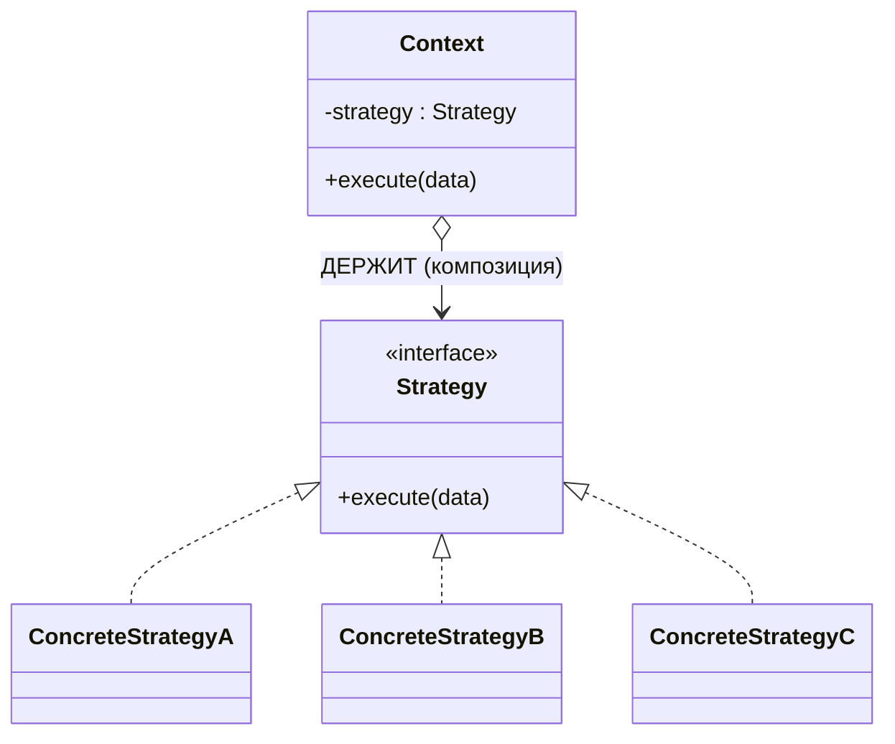

# Золотой урок: паттерн Strategy

> Глубокий разбор одного паттерна — от боли, которая его родила, до тонкостей на собесе. Читай не спеша, код пробуй в IDE. В конце — задачи и вопросы для самопроверки.

---

## 0. Одна фраза, которую забери сразу

> **Strategy — это способ передать «как делать» как объект.** Алгоритм перестаёт быть куском кода внутри метода и становится отдельной вещью, которую можно подменить, передать в параметр, положить в поле, выбрать в рантайме.

Всё остальное в этом файле — раскрытие этой фразы.

---

## 1. Проблема, которая рождает Strategy

Начинается всегда невинно. Метод считает комиссию:

```java
double calculateFee(double amount) {
    return amount * 0.02;   // 2%
}
```

Потом приходит бизнес: «у VIP — бесплатно, у партнёров — 1% плюс фикс». И метод обрастает:

```java
double calculateFee(String clientType, double amount) {
    if (clientType.equals("VIP")) {
        return 0;
    } else if (clientType.equals("REGULAR")) {
        return amount * 0.02;
    } else if (clientType.equals("PARTNER")) {
        return amount * 0.01 + 5;
    }
    throw new IllegalArgumentException("Unknown type");
}
```

Работает. Но это **бомба замедленного действия**, и вот три взрыва:

**Взрыв 1 — каждый новый тип вскрывает работающий метод (нарушение OCP).** `STUDENT`? `CORPORATE`? Ты лезешь **внутрь** протестированного `calculateFee` и дописываешь ветку. Операция на открытом сердце: рискуешь сломать соседние формулы, обязан перетестировать весь метод.

**Взрыв 2 — три несвязанные формулы живут в одном месте (нарушение SRP).** У метода теперь три причины меняться: поменялось VIP-правило / REGULAR / PARTNER. Формулу PARTNER нельзя протестировать отдельно — только дёргая весь метод со строкой. Нельзя переиспользовать в другом месте, не таща весь калькулятор.

**Взрыв 3 — тип строкой.** `"VVIP"` компилятор не поймает — код соберётся, а рухнет в рантайме. Ошибки утекают из компайл-тайма в рантайм.

Запомни этот **запах**: `if/else` или `switch` **по типу**, где в каждой ветке — своя реализация одного и того же по смыслу действия. Увидел — здесь просится Strategy.

---

## 2. Ядро идеи

Что общего у трёх веток? Все они отвечают на один вопрос — «как посчитать комиссию» — но **по-разному**. Это и есть определение варьируемого алгоритма.

Идея Strategy: вынести **каждый способ считать** в отдельный объект за общим интерфейсом. Тогда:
- добавить способ = добавить класс (не трогая старое) → **OCP**;
- каждая формула изолирована и тестируется отдельно → **SRP**;
- калькулятор зависит от абстракции «умею считать комиссию», а не от конкретных формул → **DIP**.

```java
interface FeeStrategy {
    double calculate(double amount);
}

class VipFee     implements FeeStrategy { public double calculate(double a) { return 0; } }
class RegularFee implements FeeStrategy { public double calculate(double a) { return a * 0.02; } }
class PartnerFee implements FeeStrategy { public double calculate(double a) { return a * 0.01 + 5; } }
```

И место, где раньше был `if/else`, становится тупым делегированием:

```java
class FeeCalculator {
    double calculate(FeeStrategy strategy, double amount) {
        return strategy.calculate(amount);   // никаких if — просто делегирует
    }
}
```

**Ключевое прозрение, которое отделяет понявших от зазубривших:**

> `FeeCalculator` **не выбирает** стратегию. Он **получает её готовой** и делегирует. «Какую стратегию взять» — вообще не его забота.

Если ты внутри калькулятора пишешь `if` для выбора стратегии — ты не понял паттерн, `if/else` просто переехал. Выбор стратегии живёт **снаружи** (у вызывающего кода, в фабрике или в Map — см. раздел 6).

---

## 3. Анатомия: три роли

У Strategy всегда ровно три участника. Знать их имена полезно — на собесе спрашивают именно в этих терминах.



- **Strategy** (интерфейс) — контракт «что умеет любой алгоритм». У нас `FeeStrategy`.
- **ConcreteStrategy** — конкретная реализация алгоритма. `VipFee`, `RegularFee`, `PartnerFee`.
- **Context** — тот, кто **держит** стратегию и ей пользуется, не зная конкретного класса. `FeeCalculator`.

Связь Context → Strategy — это **композиция** (`has-a`), не наследование. Context *имеет* стратегию, а не *является* ею. Вот почему Strategy — прикладное «composition over inheritance».

---

## 4. Почему это работает: полиморфизм под капотом

Когда `FeeCalculator` зовёт `strategy.calculate(amount)`, JVM в рантайме смотрит на **реальный объект** за ссылкой `strategy` и вызывает его версию `calculate` (dynamic dispatch). Это обычный полиморфизм переопределённых методов.

То есть Strategy не добавляет новой магии — он **упаковывает полиморфизм в удобную форму**: «алгоритм = объект, который можно передать». Вся мощь в том, что `FeeCalculator` написан против **абстракции** `FeeStrategy` и потому работает со всеми реализациями, **включая те, что напишут после него**.

---

## 5. Четыре формы Strategy в Java

Это важнейший раздел: на собесе ценят, когда ты знаешь, что Strategy — не обязательно «интерфейс + три класса». В современной Java он часто выглядит совсем иначе.

### Форма A — классическая (интерфейс + классы)

То, что выше. Уместна, когда у стратегии есть **состояние** (поля) или она сложная.

```java
class PercentageFee implements FeeStrategy {
    private final double rate;                       // состояние → нужен класс
    PercentageFee(double rate) { this.rate = rate; }
    public double calculate(double amount) { return amount * rate; }
}
```

### Форма B — лямбда (современная, самая частая)

Если интерфейс стратегии **функциональный** (один абстрактный метод), реализация — это просто лямбда. Никаких классов.

```java
@FunctionalInterface
interface FeeStrategy { double calculate(double amount); }

FeeStrategy vip     = amount -> 0;
FeeStrategy regular = amount -> amount * 0.02;
FeeStrategy partner = amount -> amount * 0.01 + 5;

new FeeCalculator().calculate(regular, 1000);   // 20
```

> **Прозрение:** лямбда **и есть** стратегия. Когда ты передаёшь лямбду в метод — ты применяешь Strategy, даже если не называешь это так. Java-функциональные интерфейсы (`Function`, `Predicate`, `Comparator`, `Runnable`) — это встроенные стратегии.

### Форма C — enum (когда набор стратегий фиксирован и известен заранее)

Каждая константа enum несёт свою реализацию. Компактно и типобезопасно (никаких строк!).

```java
enum FeeType {
    VIP     { public double calculate(double a) { return 0; } },
    REGULAR { public double calculate(double a) { return a * 0.02; } },
    PARTNER { public double calculate(double a) { return a * 0.01 + 5; } };

    public abstract double calculate(double amount);
}

FeeType.PARTNER.calculate(1000);   // 15
```

Плюс: тип клиента теперь `enum`, опечатку ловит компилятор. Минус: набор жёстко зашит в enum — добавить стратегию можно только правкой enum (частичный компромисс с OCP).

### Форма D — Spring-бины (см. раздел 6)

---

## 6. Кто выбирает стратегию? (и связь с Factory)

Context не выбирает — но кто-то же должен. Три типовых ответа:

### Вариант 1 — выбирает вызывающий код

```java
FeeStrategy strategy = user.isVip() ? new VipFee() : new RegularFee();
calculator.calculate(strategy, amount);
```

### Вариант 2 — Map (данные вместо if)

```java
private static final Map<String, FeeStrategy> STRATEGIES = Map.of(
    "VIP",     new VipFee(),
    "REGULAR", new RegularFee(),
    "PARTNER", new PartnerFee()
);

FeeStrategy s = STRATEGIES.get(clientType);
if (s == null) throw new IllegalArgumentException("Unknown: " + clientType);
```

`if/else` превратился в поиск по мапе. Добавить тип = строка в мапу.

### Вариант 3 — Factory

Выбор-и-создание выносится в отдельный класс `FeeStrategyFactory` (см. PATTERNS.md). **Strategy и Factory — напарники:** Strategy определяет взаимозаменяемые алгоритмы, Factory решает, какой создать.

### Вариант 4 — Spring собирает всё сам ⭐

Самый частый в проде. Стратегии — бины, и Spring инжектит их **автоматически** в `Map` (ключ = имя бина) или `List`.

```java
@Component("VIP")
class VipFee implements FeeStrategy { public double calculate(double a) { return 0; } }

@Component("REGULAR")
class RegularFee implements FeeStrategy { public double calculate(double a) { return a * 0.02; } }

@Service
class FeeService {
    private final Map<String, FeeStrategy> strategies;   // Spring наполнит ВСЕМИ бинами FeeStrategy

    public FeeService(Map<String, FeeStrategy> strategies) {
        this.strategies = strategies;
    }

    public double calculate(String clientType, double amount) {
        FeeStrategy strategy = strategies.get(clientType);
        if (strategy == null) throw new IllegalArgumentException("Unknown: " + clientType);
        return strategy.calculate(amount);
    }
}
```

> Добавить `StudentFee` = создать класс с `@Component("STUDENT")`. `FeeService` **не трогаешь вообще** — Spring сам добавит бин в мапу. Вот это OCP в полный рост. Твой `List<Validator>` из HR-задачи — это ровно оно.

---

## 7. Живые примеры Strategy (чтобы узнавать в дикой природе)

- **`Comparator` — самый используемый Strategy в Java.** `list.sort(comparator)` — ты передаёшь **стратегию сравнения** как объект. Разные компараторы = разные алгоритмы порядка.
  ```java
  employees.sort(Comparator.comparing(Employee::getSalary));        // одна стратегия
  employees.sort(Comparator.comparing(Employee::getName).reversed()); // другая
  ```
- **`Predicate` / `Function`** в Stream API — стратегии фильтрации/преобразования, переданные лямбдой.
- **Валидация** — набор `Validator`-ов, каждый своя стратегия проверки (твоя HR-задача).
- **Скидки / тарифы / комиссии** — разные формулы (этот урок).
- **Сжатие / сериализация** — `ZipStrategy`, `GzipStrategy`, `JsonSerializer` vs `XmlSerializer`.
- **Retry / backoff политики** — `FixedDelay`, `ExponentialBackoff`.
- **Spring:** `PasswordEncoder` (BCrypt/Argon2/…), `RewardPointsCalculator`, любой интерфейс с несколькими `@Component`-реализациями.

Если можешь сказать «здесь несколько взаимозаменяемых способов сделать одно и то же» — это Strategy.

---

## 8. Strategy vs его двойники (собесные ловушки)

### Strategy vs Template Method

Оба прячут варьируемую часть. Разница — **чем**:

| | Strategy | Template Method |
|---|---|---|
| Механизм | **композиция** (алгоритм — отдельный объект) | **наследование** (`protected abstract` шаг) |
| Что варьируется | **весь алгоритм** | **шаг** внутри фиксированного скелета |
| Смена в рантайме | да (подменил объект в поле) | нет (тип объекта фиксирован при создании) |
| Кто главный | клиент собирает Context + Strategy | базовый класс дирижирует, зовёт шаги |

### Strategy vs State ⭐ (любимый вопрос)

**Структура почти идентична** — интерфейс, реализации, контекст, который держит одну из них. Но **намерение разное**, и в этом весь ответ:

| | Strategy | State |
|---|---|---|
| Намерение | взаимозаменяемые **алгоритмы** | поведение зависит от **внутреннего состояния** |
| Кто меняет | **клиент** выбирает стратегию извне | объект **сам** переходит между состояниями |
| Знают ли друг о друге | стратегии **независимы**, не знают о других | состояния **знают** о переходах (`draft → submitted → approved`) |
| Меняется ли по ходу | обычно ставится один раз | меняется постоянно в ходе жизни объекта |

> Формула на собес: **Strategy — «как сделать», выбирает клиент. State — «в каком я режиме», меняет объект сам.** Одинаковая структура, разный смысл.

### Strategy vs просто полиморфизм

Резонный вопрос: «а чем Strategy отличается от обычного `interface` + реализаций?» Ответ: **Strategy — это полиморфизм плюс намерение**. Ты сознательно делаешь алгоритм *подменяемым и передаваемым*, а Context — не знающим о конкретике. Технически да, это интерфейс с реализациями; паттерном это становится из-за роли Context, который держит стратегию как заменяемую деталь.

---

## 9. Когда НЕ надо (чтобы не переусердствовать)

Паттерны — не всегда добро. Strategy вреден, когда:

- **Алгоритм один и меняться не будет.** Три класса и интерфейс ради одной формулы — это оверинжиниринг. Оставь метод.
- **Ветвей две и они тривиальны, навсегда.** Простой `if` читается лучше, чем инфраструктура из классов.
- **Стратегии никогда не выбираются динамически** и различие чисто косметическое.

Признак здравого применения: **алгоритмов реально несколько, они меняются/добавляются, и выбор происходит в рантайме.** Нет этого — не тащи паттерн.

> Правило: сначала боль (растущий `if/else` по типу), потом паттерн. Не наоборот.

---

## 10. Как Strategy реализует SOLID (собери в голове)

- **OCP** — новый алгоритм = новый класс/лямбда/бин, существующий код не трогается.
- **SRP** — каждый алгоритм в своём месте, тестируется и меняется независимо.
- **DIP** — Context зависит от абстракции `Strategy`, а не от конкретных алгоритмов.
- **Композиция > наследование** — Context держит стратегию, а не наследует поведение.
- (косвенно **LSP**) — любую стратегию можно подставить вместо `Strategy`, Context не заметит разницы.

> Strategy — концентрированный SOLID. Если понял его — понял половину принципов в действии.

---

## 11. Частые ошибки

1. **`if` выбора стратегии внутри Context.** Тогда `if/else` просто переехал, смысл потерян. Выбор — снаружи.
2. **Тип строкой без валидации.** `map.get(type)` вернёт `null` → NPE далеко от причины. Бросай явную ошибку.
3. **`public static` мутабельная мапа стратегий.** Открытое состояние, любой снаружи сломает. `private static final`.
4. **Стратегия с состоянием как синглтон-бин, но её мутируют.** Stateless-стратегии безопасны как синглтоны; если стратегия хранит per-request данные — это уже не стратегия, пересмотри дизайн.
5. **Забыл `public` на реализации метода интерфейса** — не скомпилируется (нельзя сузить видимость).
6. **Оверинжиниринг** — Strategy там, где хватило бы одного метода.

---

## 12. Вопросы, которые задают на собесе (с ответами)

**«Что такое Strategy и какую проблему решает?»**
> Инкапсулирует семейство взаимозаменяемых алгоритмов, делая их подменяемыми. Решает проблему растущего `if/else`/`switch` по типу: новый алгоритм добавляется новым классом, а не правкой существующего метода (OCP).

**«Чем Strategy отличается от State?»**
> Структура одинаковая, намерение разное. Strategy — взаимозаменяемые алгоритмы, выбирает клиент извне, стратегии независимы. State — поведение зависит от внутреннего состояния, объект сам переходит между состояниями, которые знают о переходах.

**«Приведи пример Strategy из стандартной библиотеки.»**
> `Comparator` — стратегия сравнения, передаётся в `sort()`. Также `Predicate`/`Function` в Stream API. Любой функциональный интерфейс, передаваемый лямбдой, — это Strategy.

**«Как реализовать Strategy без создания классов?»**
> Через лямбды, если интерфейс функциональный. `FeeStrategy vip = a -> 0;` — лямбда и есть конкретная стратегия.

**«Как выбирается нужная стратегия?»**
> Не контекстом. Клиентом, фабрикой, `Map<ключ, стратегия>`, а в Spring — инъекцией `Map<String, Strategy>`, которую контейнер наполняет всеми бинами интерфейса.

**«Какие принципы SOLID реализует Strategy?»**
> Прежде всего OCP (расширение без изменения) и DIP (зависимость от абстракции), плюс SRP (каждый алгоритм изолирован) и композиция вместо наследования.

**«Когда Strategy — плохая идея?»**
> Когда алгоритм один и не меняется, или ветвей мало и они тривиальны навсегда. Тогда паттерн — оверинжиниринг.

---

## 13. Задачи для тренировки (по нарастанию)

Делай в IDE, до зелёной компиляции.

**Уровень 1 — классика.** Движок скидок: `DiscountStrategy` с методом `apply(BigDecimal price)`. Реализации: `NoDiscount`, `PercentageDiscount(percent)`, `FixedDiscount(amount)`. Контекст `Checkout`, который держит стратегию и считает итог.

**Уровень 2 — лямбды.** Перепиши уровень 1 так, чтобы `DiscountStrategy` был `@FunctionalInterface`, а три стратегии стали лямбдами/переменными. Прочувствуй, что классы исчезли.

**Уровень 3 — enum.** Сделай `ShippingMethod` (STANDARD/EXPRESS/PICKUP) как enum-стратегию с методом `double cost(double weight)`, у каждого своя формула.

**Уровень 4 — Spring.** Три `@Component`-стратегии расчёта бонусных баллов (`Bronze`, `Silver`, `Gold`), сервис инжектит `Map<String, PointsStrategy>` и выбирает по уровню клиента. Добавь четвёртую (`Platinum`) — убедись, что сервис править не пришлось.

**Уровень 5 — рефактор.** Возьми любой свой продовый метод с `switch` по типу и вырежи Strategy. Сравни читаемость и тестируемость до/после.

---

## 14. Проверь себя (закрой файл, ответь вслух)

1. Какой запах в коде кричит «сюда Strategy»?
2. Три роли паттерна — назови и объясни каждую.
3. Почему Context не должен сам выбирать стратегию? Кто выбирает?
4. Назови четыре формы Strategy в Java.
5. Почему `Comparator` — это Strategy?
6. Strategy vs State — структура одинаковая, а разница в чём?
7. Strategy vs Template Method — чем прячут варьируемое (механизм)?
8. Как Spring наполняет `Map<String, Strategy>` и почему это идеальный OCP?
9. Когда Strategy — это оверинжиниринг?
10. Какие принципы SOLID он реализует и как?

> Ответил на все десять своими словами — Strategy у тебя не выучен, а понят.
