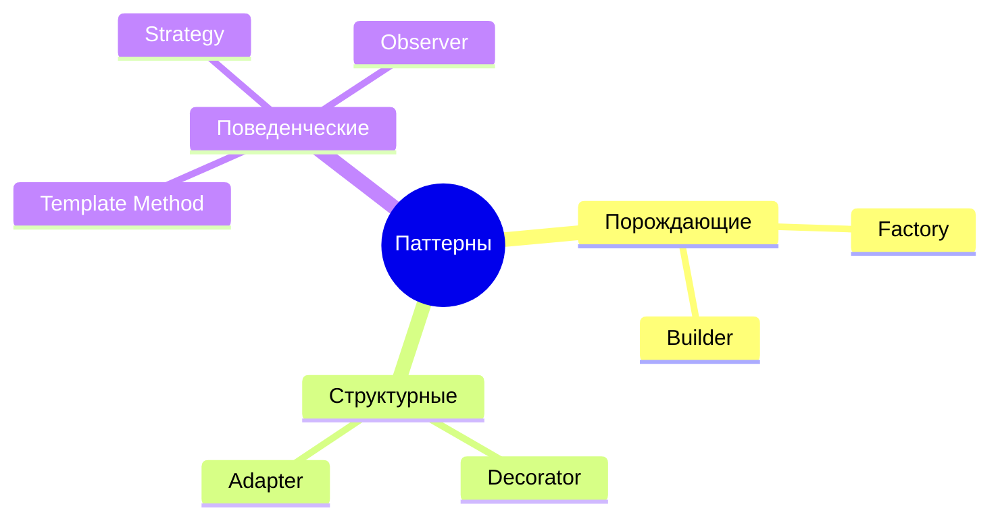

# Почему паттерны делятся на три типа

Простое объяснение, чтобы раз и навсегда понять, откуда взялись три группы паттернов. Без глубины — только суть.

---

## Главная идея (запомни только это)

У любого объекта в программе есть **три момента жизни**:


На **каждый** момент придумали свой набор паттернов. Три момента → три типа. Вот и вся классификация.

| Момент жизни объекта | Тип паттернов | Вопрос, на который отвечает |
|---|---|---|
| его **создают** | **Порождающие** | «как создать?» |
| его **соединяют** в структуру | **Структурные** | «как соединить?» |
| он **работает** с другими | **Поведенческие** | «как взаимодействовать?» |

---

## Аналогия: машина 🚗

- **Как машину собрали на заводе** — это про **создание** → порождающие паттерны.
- **Из каких деталей она состоит и как они скреплены** — это про **структуру** → структурные паттерны.
- **Как она едет, как детали работают вместе на ходу** — это про **поведение** → поведенческие паттерны.

Собрали → скрепили → поехали. Три этапа — три типа.

---

## Тип 1 — Порождающие (про создание)

**Вопрос:** как создать объект правильно?

**Боль:** обычный `new` жёстко привязывает тебя к конкретному классу.

```java
OrderService service = new MySqlOrderService();  // ты НАВСЕГДА привязан к MySQL
```

Захотел поменять на Postgres — лезь и правь код везде, где `new`. Порождающие паттерны **прячут создание** в отдельное место, чтобы клиент не зависел от конкретного класса.

**Наши паттерны:** Factory (кто-то другой решит, какой объект создать), Builder (собрать сложный объект по шагам).

> Суть типа: **отделить «что создаётся» от «как создаётся».**

---

## Тип 2 — Структурные (про соединение)

**Вопрос:** как соединить объекты в большую структуру, не наплодив классов?

**Боль:** наивный ответ — наследование. Но оно раздувает число классов и делает всё жёстким. Ещё боль — чужой интерфейс не стыкуется с твоим.

Структурные паттерны отвечают: **оборачивай объекты друг в друга** вместо наследования.

**Наши паттерны:** Decorator (обернуть и **добавить** поведение), Adapter (обернуть и **перевести** чужой интерфейс в свой).

> Суть типа: **собирать структуры обёртыванием, а не иерархией наследования.**

---

## Тип 3 — Поведенческие (про взаимодействие)

**Вопрос:** как объекты распределяют работу и общаются между собой?

**Боль:** один класс знает слишком много — сам решает «как» через `if/else`, сам зовёт всех поимённо, сам всем дирижирует.

Поведенческие паттерны **распределяют обязанности** и **развязывают** участников.

**Наши паттерны:** Strategy (алгоритм — отдельный объект), Template Method (скелет мой, шаги твои), Observer (я объявляю факт, кто отреагирует — не моё дело).

> Суть типа: **вынести решение/реакцию туда, где ей место, и развязать участников.**

---

## Как этим пользоваться: боль → тип

Наткнулся на боль в коде → спроси, на каком этапе она, и смотри в нужный тип:

| Боль звучит как… | Смотри в тип |
|---|---|
| «`new` разбросан по коду, клиент знает все классы» / «конструктор — каша» | **Порождающие** |
| «плодятся классы на каждую комбинацию» / «чужой интерфейс не стыкуется» | **Структурные** |
| «`if/else` по типу» / «класс дирижирует всеми» / «дублируется скелет» | **Поведенческие** |

---

## Карта: наши 6 паттернов по типам



---

## Маленькая оговорка (чтобы не зубрить как закон)

Границы **не абсолютны**. Например, Factory (порождающий) часто создаёт Strategy (поведенческий) — они работают вместе. А Decorator и Adapter оба оборачивают, но решают разные задачи.

Классификация — это **подсказка, где искать решение**, а не жёсткий закон. Но на собесе от тебя ждут, что ты назовёшь тип и объяснишь **почему** — само деление на три группы уже показывает понимание.

---

## Проверь себя

1. Какие три момента жизни объекта → три типа паттернов?
2. Порождающие / Структурные / Поведенческие — какой вопрос задаёт каждый?
3. Почему `new ConcreteClass()` — это плохо, и какой тип паттернов это лечит?
4. У тебя в коде растёт `if/else` по типу клиента — в какой тип смотреть?
5. Чужой SDK не стыкуется с твоим интерфейсом — какой тип и какой паттерн?

> Ответил на все пять своими словами — классификацию ты понял, а не выучил.
