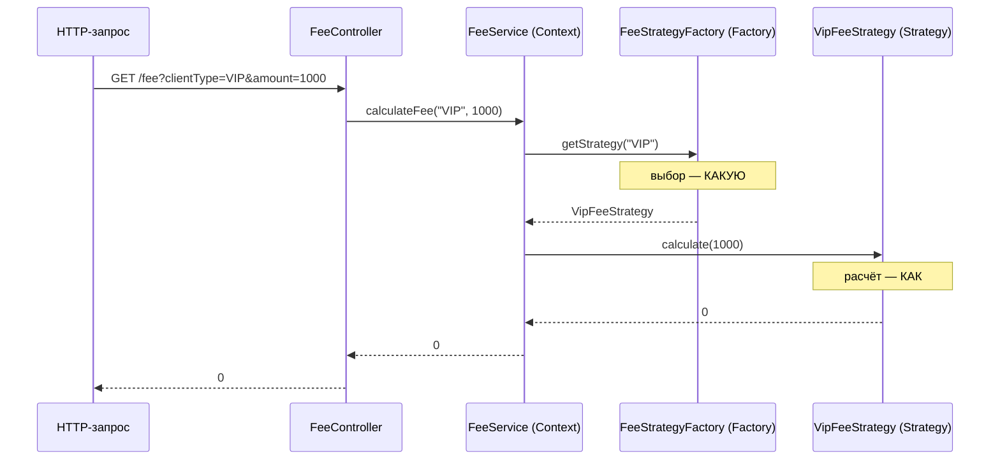

# Пет-проект: Strategy + Factory на Spring Boot

Маленький рабочий проект, чтобы **раз и навсегда понять разницу** между Strategy и Factory на одном примере.

## Разница в одном предложении

> **Strategy** — это сами алгоритмы, «**КАК** посчитать комиссию» (много классов, по одному на формулу).
> **Factory** — это выбор нужного алгоритма, «**КАКУЮ** формулу взять для этого клиента» (один класс).
>
> Обрати внимание на ключевое: **в фабрике нет ни одной формулы. В стратегиях нет ни одного выбора.** Разные работы — разные классы.

**Что делает проект:** REST-эндпоинт считает комиссию за платёж. У VIP — 0, у обычного — 2%, у партнёра — 1% + 5. Тип клиента приходит в запросе.

---

## Структура проекта

```
src/main/java/com/example/fees/
├── FeesApplication.java              ← точка входа Spring Boot
├── strategy/
│   ├── FeeStrategy.java              ← STRATEGY: интерфейс (контракт "умею считать комиссию")
│   ├── VipFeeStrategy.java           ← STRATEGY: формула для VIP
│   ├── RegularFeeStrategy.java       ← STRATEGY: формула для обычного
│   └── PartnerFeeStrategy.java       ← STRATEGY: формула для партнёра
├── factory/
│   └── FeeStrategyFactory.java       ← FACTORY: выбирает нужную стратегию по типу
├── service/
│   └── FeeService.java               ← CONTEXT: пользуется фабрикой + стратегией
└── web/
    └── FeeController.java            ← вход: HTTP-запрос
```

Обрати внимание: папки `strategy/` и `factory/` **разделены физически** — это подчёркивает, что роли разные.

---

## 1. `pom.xml` (зависимости — только web)

```xml
<project>
    <modelVersion>4.0.0</modelVersion>
    <parent>
        <groupId>org.springframework.boot</groupId>
        <artifactId>spring-boot-starter-parent</artifactId>
        <version>3.3.0</version>
    </parent>
    <groupId>com.example</groupId>
    <artifactId>fees</artifactId>
    <version>1.0.0</version>

    <properties>
        <java.version>21</java.version>
    </properties>

    <dependencies>
        <!-- всё, что нужно для REST -->
        <dependency>
            <groupId>org.springframework.boot</groupId>
            <artifactId>spring-boot-starter-web</artifactId>
        </dependency>
    </dependencies>

    <build>
        <plugins>
            <plugin>
                <groupId>org.springframework.boot</groupId>
                <artifactId>spring-boot-maven-plugin</artifactId>
            </plugin>
        </plugins>
    </build>
</project>
```

---

## 2. Точка входа

```java
package com.example.fees;

import org.springframework.boot.SpringApplication;
import org.springframework.boot.autoconfigure.SpringBootApplication;

@SpringBootApplication
public class FeesApplication {
    public static void main(String[] args) {
        SpringApplication.run(FeesApplication.class, args);
    }
}
```

---

## 3. STRATEGY — интерфейс

Это **контракт**: «любой, кто умеет считать комиссию, реализует этот метод». Никакой логики выбора здесь нет и быть не может.

```java
package com.example.fees.strategy;

import java.math.BigDecimal;

// STRATEGY (роль "Strategy" из паттерна) — контракт семейства алгоритмов.
// Каждый способ посчитать комиссию будет отдельной реализацией этого интерфейса.
public interface FeeStrategy {

    // единственный вопрос, на который отвечает стратегия: "сколько комиссия с этой суммы?"
    BigDecimal calculate(BigDecimal amount);
}
```

---

## 4. STRATEGY — три реализации (сами формулы)

Каждый класс — **одна формула**. Он ничего не знает про другие стратегии и про то, когда его выберут. Его дело — посчитать.

Важная деталь: в `@Component("VIP")` мы **даём бину имя** — оно станет ключом, по которому фабрика его найдёт.

```java
package com.example.fees.strategy;

import org.springframework.stereotype.Component;
import java.math.BigDecimal;

// STRATEGY #1. Имя бина "VIP" — по нему фабрика достанет эту стратегию.
@Component("VIP")
public class VipFeeStrategy implements FeeStrategy {

    @Override
    public BigDecimal calculate(BigDecimal amount) {
        // VIP платит без комиссии
        return BigDecimal.ZERO;
    }
}
```

```java
package com.example.fees.strategy;

import org.springframework.stereotype.Component;
import java.math.BigDecimal;

// STRATEGY #2
@Component("REGULAR")
public class RegularFeeStrategy implements FeeStrategy {

    @Override
    public BigDecimal calculate(BigDecimal amount) {
        // обычный клиент: 2% от суммы
        return amount.multiply(new BigDecimal("0.02"));
    }
}
```

```java
package com.example.fees.strategy;

import org.springframework.stereotype.Component;
import java.math.BigDecimal;

// STRATEGY #3
@Component("PARTNER")
public class PartnerFeeStrategy implements FeeStrategy {

    @Override
    public BigDecimal calculate(BigDecimal amount) {
        // партнёр: 1% + фиксированные 5
        return amount.multiply(new BigDecimal("0.01")).add(new BigDecimal("5"));
    }
}
```

> Заметь: три класса выше — это **всё "КАК"**. Ни один из них не решает, кого применить. Они просто умеют считать. Это и есть Strategy.

---

## 5. FACTORY — выбирает нужную стратегию

А вот теперь — **другая работа**. Фабрика не считает комиссию (в ней нет ни одной формулы!). Её единственное дело — по типу клиента **отдать правильную стратегию**.

Магия Spring: если попросить `Map<String, FeeStrategy>`, контейнер сам сложит туда **все** бины типа `FeeStrategy`, где **ключ = имя бина** (`"VIP"`, `"REGULAR"`, `"PARTNER"`).

```java
package com.example.fees.factory;

import com.example.fees.strategy.FeeStrategy;
import org.springframework.stereotype.Component;
import java.util.Map;

// FACTORY (роль "Factory" из паттерна) — единственная работа: выбрать стратегию по типу.
// ВНИМАНИЕ: тут НЕТ ни одной формулы расчёта. Только выбор.
@Component
public class FeeStrategyFactory {

    // Spring сам наполнит эту мапу ВСЕМИ бинами FeeStrategy.
    // Ключ = имя бина из @Component("VIP" / "REGULAR" / "PARTNER").
    private final Map<String, FeeStrategy> strategies;

    // инъекция через конструктор
    public FeeStrategyFactory(Map<String, FeeStrategy> strategies) {
        this.strategies = strategies;
    }

    // "дай мне стратегию для клиента такого типа"
    public FeeStrategy getStrategy(String clientType) {
        FeeStrategy strategy = strategies.get(clientType);
        if (strategy == null) {
            // тип неизвестен → падаем громко и сразу, а не тихим NPE позже
            throw new IllegalArgumentException("Неизвестный тип клиента: " + clientType);
        }
        return strategy;
    }
}
```

> Вот он, водораздел: **фабрика знает, ГДЕ какая стратегия, но не знает, КАК они считают. Стратегии знают, КАК считать, но не знают, КОГДА их выберут.** Две ортогональные обязанности в двух местах.

---

## 6. CONTEXT — сервис, который пользуется обоими

Здесь виден весь паттерн в **двух строчках**. Прочитай их медленно — в них вся суть комбо:

```java
package com.example.fees.service;

import com.example.fees.factory.FeeStrategyFactory;
import com.example.fees.strategy.FeeStrategy;
import org.springframework.stereotype.Service;
import java.math.BigDecimal;

// CONTEXT (роль "Context" из паттерна Strategy) — тот, кто пользуется стратегией,
// не зная её конкретного класса.
@Service
public class FeeService {

    private final FeeStrategyFactory factory;

    public FeeService(FeeStrategyFactory factory) {
        this.factory = factory;
    }

    public BigDecimal calculateFee(String clientType, BigDecimal amount) {
        // ШАГ 1 — FACTORY решает, КАКУЮ стратегию взять:
        FeeStrategy strategy = factory.getStrategy(clientType);

        // ШАГ 2 — STRATEGY решает, КАК посчитать:
        return strategy.calculate(amount);
    }
}
```

> Эти две строки — весь смысл урока:
> `factory.getStrategy(clientType)` → **какую** (Factory)
> `strategy.calculate(amount)` → **как** (Strategy)
>
> Сервис (Context) не знает ни формул, ни того, как устроен выбор. Он только соединяет два ответа.

---

## 7. Вход — REST-контроллер

```java
package com.example.fees.web;

import com.example.fees.service.FeeService;
import org.springframework.web.bind.annotation.GetMapping;
import org.springframework.web.bind.annotation.RequestParam;
import org.springframework.web.bind.annotation.RestController;
import java.math.BigDecimal;

@RestController
public class FeeController {

    private final FeeService feeService;

    public FeeController(FeeService feeService) {
        this.feeService = feeService;
    }

    // GET /fee?clientType=VIP&amount=1000
    @GetMapping("/fee")
    public BigDecimal calculate(@RequestParam String clientType,
                                @RequestParam BigDecimal amount) {
        return feeService.calculateFee(clientType, amount);
    }
}
```

---

## Как это работает — поток запроса



---

## Кто за что отвечает (главная таблица урока)

| | **Strategy** | **Factory** |
|---|---|---|
| Отвечает на вопрос | **КАК** посчитать | **КАКУЮ** взять |
| Что внутри | формулы расчёта | выбор/поиск по ключу |
| Сколько классов | много (по одному на алгоритм) | один |
| Знает про формулы? | да (свою) | **нет** |
| Знает про выбор? | **нет** | да |
| Аналогия | инструменты в ящике | мастер, который подаёт нужный инструмент |

> Если запомнишь только одно: **фабрика без формул, стратегии без выбора.** Каждый занят своим делом — в этом вся разница.

---

## Запуск и проверка

```bash
mvn spring-boot:run
```

Проверяем разные типы клиента (сумма 1000):

```bash
curl "http://localhost:8080/fee?clientType=VIP&amount=1000"
# → 0        (VipFeeStrategy: без комиссии)

curl "http://localhost:8080/fee?clientType=REGULAR&amount=1000"
# → 20.00    (RegularFeeStrategy: 2%)

curl "http://localhost:8080/fee?clientType=PARTNER&amount=1000"
# → 15.00    (PartnerFeeStrategy: 1% + 5)

curl "http://localhost:8080/fee?clientType=XYZ&amount=1000"
# → 400, "Неизвестный тип клиента: XYZ"  (фабрика бросила исключение)
```

---

## Упражнение (вот тут щёлкнет OCP)

Добавь тип `STUDENT` с комиссией 1.5%. Тебе понадобится создать **ровно один** новый класс:

```java
package com.example.fees.strategy;

import org.springframework.stereotype.Component;
import java.math.BigDecimal;

@Component("STUDENT")
public class StudentFeeStrategy implements FeeStrategy {
    @Override
    public BigDecimal calculate(BigDecimal amount) {
        return amount.multiply(new BigDecimal("0.015")); // 1.5%
    }
}
```

И теперь **посмотри, что тебе НЕ пришлось трогать:**
- `FeeStrategyFactory` — **не трогал** (Spring сам добавит новый бин в мапу);
- `FeeService` — **не трогал**;
- `FeeController` — **не трогал**;
- старые стратегии — **не трогал**.

Один новый класс — и `STUDENT` работает. Вот это и есть **OCP** (открыт для расширения, закрыт для изменения), который дают Strategy + Factory в связке.

```bash
curl "http://localhost:8080/fee?clientType=STUDENT&amount=1000"
# → 15.000   (1.5%)
```

---

## Итог урока

1. **Strategy** = семья формул, каждая в своём классе. Отвечает «КАК».
2. **Factory** = один класс, который выбирает нужную формулу по входу. Отвечает «КАКУЮ».
3. **Context** (сервис) соединяет их в две строки: `factory.getStrategy(...)` + `strategy.calculate(...)`.
4. Разделение труда: **в фабрике нет формул, в стратегиях нет выбора.**
5. Добавление нового типа = один новый класс, всё остальное нетронуто (OCP).

> Собери этот проект в IntelliJ и запусти `curl`-ы. Когда увидишь, как `STUDENT` заработал без единой правки в фабрике и сервисе — разница между Strategy и Factory станет очевидной навсегда.
